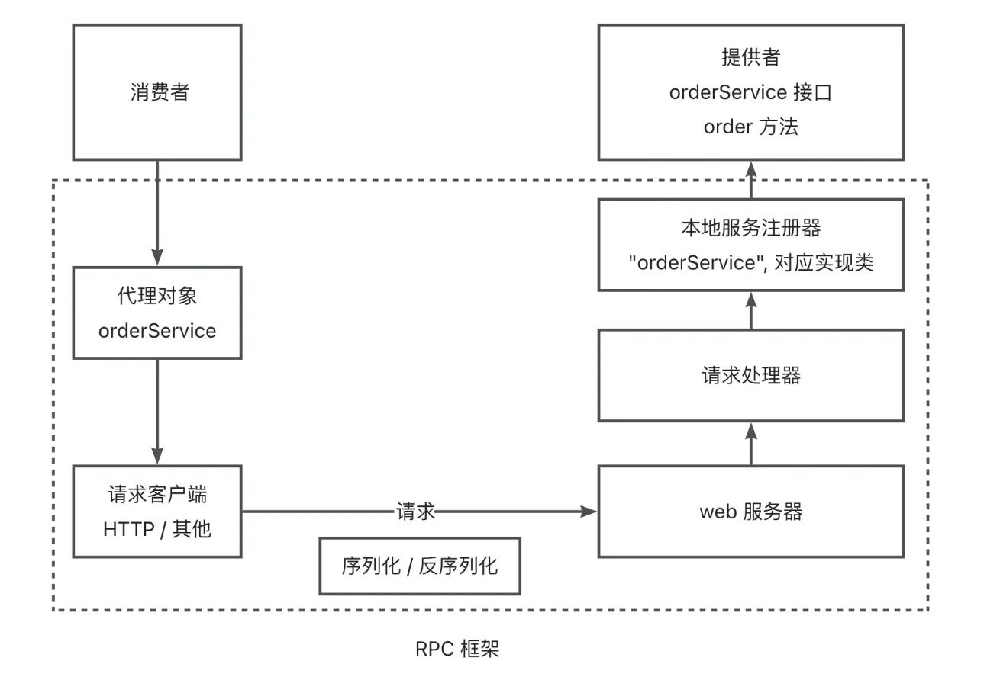
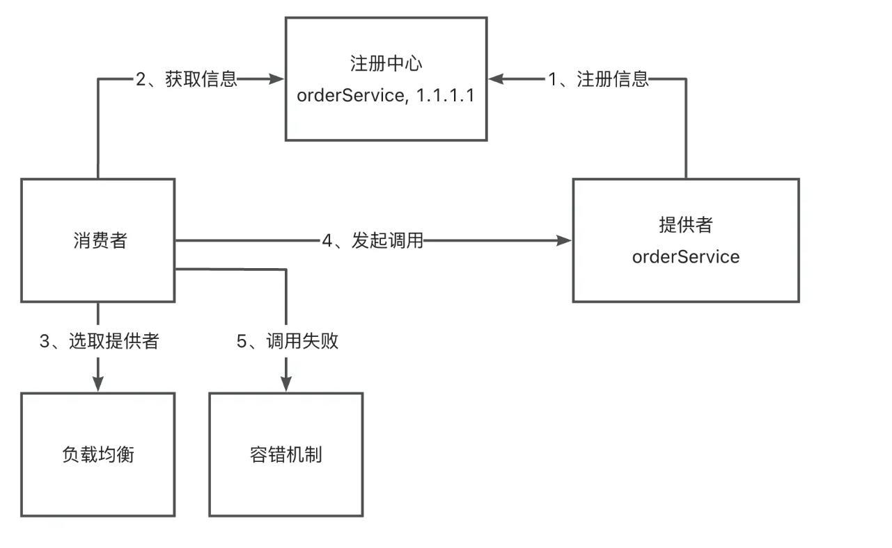
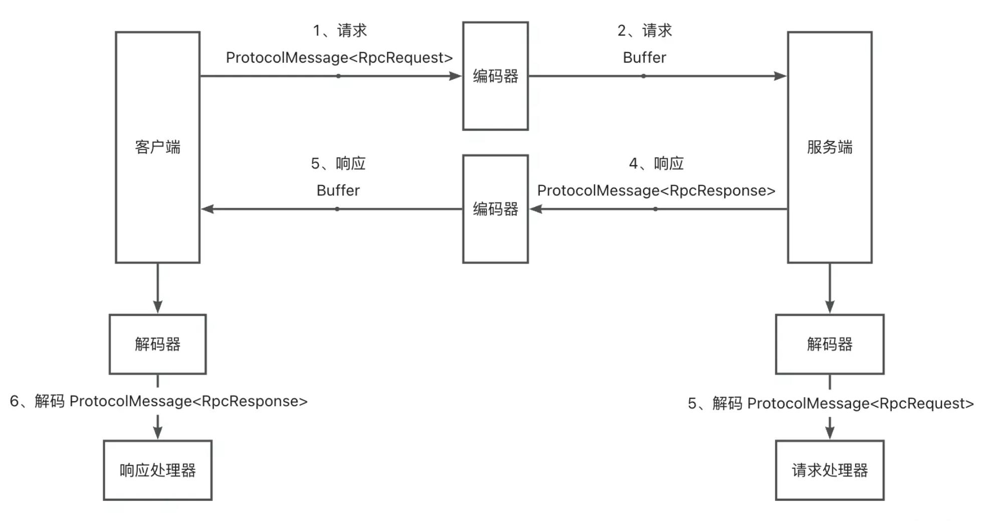

# 推荐答案

## 请介绍整个系统的核心架构设计，有哪些模块，各模块的作用，各模块之间的关系。

整个系统的核心架构设计和模块如下：

1. **消费者代理模块：** 基于代理模式实现，在服务消费者对服务提供者进行远程调用时，不需要考虑是如何实现调用的，直接调用写好的服务接口即可。

2. **注册中心：** 基于 Etcd 实现注册中心，服务提供者会将自己的地址、接口、分组等详细信息都上报到注册中心模块，并且当服务上线、下线的时候通知到注册中心；服务调用方就可以从注册中心动态获取调用信息，而不用在代码内硬编码调用地址。

3. **本地服务注册器：** 服务提供端存储服务名称和实现类的映射关系，便于后续根据服务名获取到对应的实现类，从而通过反射完成调用。

4. **路由模块（负载均衡）：** 当有多个服务和服务提供者节点时，服务消费者需要确认请求哪一个服务和节点。因此我设计了路由模块，通过实现不同算法的负载均衡器，帮助服务消费者选择一个服务节点发起调用。

5. **自定义 RPC 协议：** 自主实现了基于 Vert.x（TCP）和自定义请求头的网络传输协议，并自主实现了对字节数组的编码/解码器，可以完成性能更高的请求和响应。

6. **请求处理器：** 服务提供者在接收到请求后，可以通过请求处理器解析请求，从本地服务注册器中找到服务实现类并调用方法。

7. **重试和容错模块：** 在调用出错时，进行重试、降级、故障转移等操作，保障服务的可用性和稳定性。

8. **启动器模块：** 基于注解驱动 + Spring Boot Starter，开发者可以快速引入 RPC 框架到项目中。

模块之间的关系可以参考下面 3 张图：

**1）整体调用流程：**

**2）注册中心的作用：**

**3）自定义协议的请求响应流程：**

**下面我以一次完整的调用过程为例，讲解模块之间的关系。

1. **服务提供者启动服务：** 启动基于 Vert.x 的 TCP 服务器，并将服务信息注册到本地服务注册器和注册中心。

2. **服务消费者调用服务：** 消费者代理模块从注册中心获取到服务提供者的调用信息列表，通过负载均衡算法确定一个调用地址，并构造基于 RPC 协议的请求。然后发起请求，消息经过编码器处理。

3. **服务提供者处理请求：** 服务提供者通过解码器还原消息，根据消息内容，从本地服务注册器找到服务实现类，通过反射进行调用。

4. **服务提供者响应请求：** 服务提供者将调用结果进行封装，通过编码器处理响应消息；服务消费者收到消息后，通过解码器还原消息，从而完成调用。

5. **服务消费端重试和容错：** 如果调用失败，服务消费端会根据预设好的策略进行重试、或者进行故障转移、降级等容错操作。

---

# 练习题

## 1. 当服务消费者需要从多个服务提供者节点中选择一个发起调用时，应该由哪个模块完成这个功能？()

- A. 请求处理器
- B. 路由模块
- C. 重试和容错模块
- D. 启动器模块

## 2. 以下哪个模块不是服务消费者端的核心模块？()

- A. 消费者代理模块
- B. 注册中心
- C. 重试和容错模块
- D. 路由模块

## 3. 在RPC调用过程中，哪个模块负责对字节数组进行编码/解码处理？()

- A. 自定义RPC协议
- B. 请求处理器
- C. 本地服务注册器
- D. 启动器模块

## 4. 当RPC调用出现错误时，哪个模块会负责进行重试、降级等操作？()

- A. 路由模块
- B. 请求处理器
- C. 重试和容错模块
- D. 消费者代理模块

---

# 答案解析

**1. 正确答案：B**

官方解析：路由模块（负载均衡）负责在有多个服务和服务提供者节点时，通过实现不同算法的负载均衡器，帮助服务消费者选择一个服务节点发起调用。

**知识点：** 负载均衡、模块职责

**2. 正确答案：B**

官方解析：注册中心是一个独立的服务，既不属于服务消费者端也不属于服务提供者端，而是作为两者之间的协调者存在。其他三个选项都是服务消费者端的核心模块。

**知识点：** 模块划分、系统架构

**3. 正确答案：A**

官方解析：自定义RPC协议模块自主实现了对字节数组的编码/解码器，可以完成性能更高的请求和响应处理。这是网络传输协议的核心功能之一。

**知识点：** 数据编码、网络协议

**4. 正确答案：C**

官方解析：重试和容错模块专门用于在调用出错时，进行重试、降级、故障转移等操作，保障服务的可用性和稳定性。这是系统容错机制的核心模块。

**知识点：** 容错机制、系统稳定性
