# 手写 RPC 框架 - 学习笔记

---

## 阶段 00 - 导学和入门

### 什么是 RPC？

本身并不是一种协议，而是一种调用
常用的 RPC 协议实现：

- gRPC
- thrift

### 核心组件

| 模块                          | 描述                                                                                                                                                                                                                                                            |
| ----------------------------- | --------------------------------------------------------------------------------------------------------------------------------------------------------------------------------------------------------------------------------------------------------------- |
| **服务消费者**          | 请求处理器：根据客户端的请求参数进行处理，调用不同的服务和方法                                                                                                                                                                                                  |
| **服务提供者**          | 本地服务注册器：记录服务与对应实现类的映射关系                                                                                                                                                                                                                  |
| **序列化 / 反序列化器** | 提供请求与响应对象的高效序列化和反序列化支持                                                                                                                                                                                                                    |
| **注册中心**            | 支持 Etcd、Redis 和 ZooKeeper 用于服务注册与发现                                                                                                                                                                                                                |
| **负载均衡**            | 选取最佳服务提供者，实现多种负载均衡策略（如轮询、一致性哈希等）                                                                                                                                                                                                |
| **容错机制**            | 在调用失败时提供容错策略，如 FailSafe、FailFast、FailOver 等                                                                                                                                                                                                    |
| **其他功能**            | - 服务提供者节点下线：删除失效节点，保持服务列表一致性<br />- 缓存服务信息：本地缓存拉取的服务信息，减少注册中心访问频率 <br />- 优化网络传输：通过自定义协议头减少传输体积，选择合适的网络框架 <br />- 优化扩展性：支持 SPI 机制扩展，结合配置文件实现灵活优化 |

---

## 阶段 01 - 开发极简的 RPC 框架

### 阶段成果

搭建项目和模块：

- `exp-common`: 示例代码的公共依赖，包括接口、Model 等
- `exp-consumer`: 示例服务消费者代码
- `exp-provider`: 示例服务提供者代码
- `jools-rpc-basic`: RPC框架 - 简易版

### 各模块实现

#### exp-common 模块

| 功能             | 核心组件                 |
| ---------------- | ------------------------ |
| 实体类 model     | User 类，返回字段值 name |
| 服务接口 Service | UserService              |
| 服务方法         | getUser() 返回 User      |

#### exp-provider 模块

| 功能         | 核心组件        |
| ------------ | --------------- |
| 服务实现类   | UserServiceImpl |
| 实现服务方法 | getUser         |

#### exp-consumer 模块

| 功能               | 核心组件                                                                 |
| ------------------ | ------------------------------------------------------------------------ |
| 请求客户端         | BasicProviderExample                                                     |
| 请求发送方式       | 基于 JDK 动态代理，返回代理对象通过 HTTPRequest (Hutool 工具包) 发送请求 |
| 调用服务           | UserService                                                              |
| 调用服务方法       | getUser                                                                  |
| 消费方代理方式选型 | 静态代理 与 动态代理 (区别 + 分别实现方式 + 优缺点)                      |

#### jools-rpc-basic 模块

| 功能                                   | 核心组件                                                                                                        |
| -------------------------------------- | --------------------------------------------------------------------------------------------------------------- |
| Web 服务器                             | 使用 Vert.x，可选 Tomcat 或 Netty                                                                               |
| 本地服务注册器                         | `LocalRegistry`<br />基于 `ConcurrentHashMap`+ key 为服务名称 <br />+ value 为服务实现类全类名              |
| 通信请求实体类                         | `RpcRequest` 和 `RpcResponse`                                                                               |
| `RpcRequest` 请求消息体，支持序列化  | 请求服务名 `serviceName`<br />方法名 `methodName`<br />方法参数类型 `paramTypes`<br />传入实参 `params` |
| `RpcResponse` 响应消息体，支持序列化 | 响应数据 `data`响应数据类型 `datatype`<br />响应信息 `msg`<br />异常信息 `exception`                    |
| 序列化器                               | `JdkSerializer`，基于 JDK 原生序列化方式                                                                      |
| 请求处理器                             | `HttpServerHandler` 借助序列化器反序列化 HTTP 请求，调用本地服务注册/序列化返回响应。                         |
| 动态代理处理器                         | `ServiceProxyFactory` 返回 `ServiceProxy` 实例，实现透明调用                                                |

示意图：

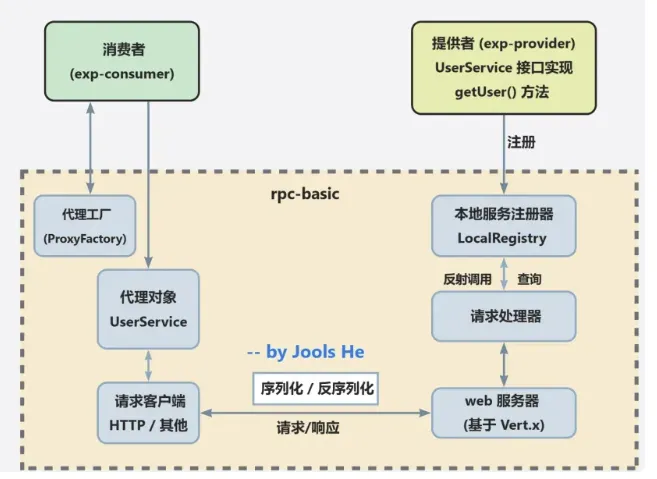

---

## 阶段 02 - 全局配置加载

### 阶段成果

- 支持基于 `application.properties` 文件加载全局配置
- 支持区分 `dev, prod` 多环境配置文件
- `(扩展)` 工具类 SnakeYAML 支持基于 `.yml / .yaml` 格式文件加载全局配置
- `(扩展)` 支持监听配置文件变更，借助 `Hutool.autoLoad()`
- `(扩展)` 配置文件支持中文

简单示意图：

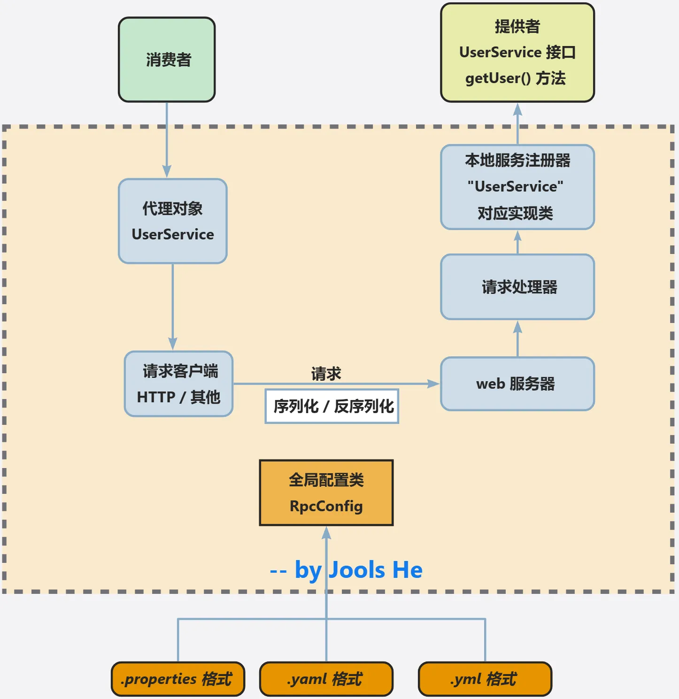

- 橙色部分为本阶段新增内容。

### 全局配置信息设计

参考 Dubbo 官方配置 ApplicationConfig 中至少含有：

- 注册中心地址：服务提供者与消费者均需指定，用于服务注册和发现。
- 服务接口：提供者指定提供的，消费者指定调用的。
- 序列化方式：双方均需指定，用于网络数据传输的序列化与反序列化。
- 网络通信协议：双方选择合适的，如 TCP、HTTP 等。
- 超时设置：双方均需设置，用于调用服务超时处理。
- 负载均衡策略：消费者指定，决定调用哪个服务提供者实例。
- 服务端线程模型：提供者指定，决定处理客户端请求方式。

### 设计实现 - RpcConfig

- name (String)：服务名称，默认值 `own-rpc`
- version (String) : 版本, 默认值 `1.0`
- serverHost (String): 主机名称，默认值 `localhost`
- serverPort (String): 服务端口, 默认值 `8888`

### 开发实现

在 `utils` 包下创建工具类 `ConfigUtils`，使用 Hutool 的 `Props` 工具加载配置。
在 `constant` 包下创建接口 `RpcConstant`，用于存储常用配置常量的默认值：

- 默认配置项前缀为 `DEFAULT_CONFIG_PREFIX = "rpc"`
- 默认配置文件格式为 `PROP_CONFIG_SUFFIX = ".properties"`

方法参数支持通过 `prefix` 字段配合 `-environment` 字段加载多环境配置。
使用双检索单例模式确保全局配置类的唯一性。
支持用户自定义 `application.properties` 文件，若未提供则使用默认配置。

### (扩展) - 支持不同格式 .yml / .yaml

```xml
<!-- Yaml配置类解析 -->
<dependency>
  <groupId>org.yaml</groupId>
  <artifactId>snakeyaml</artifactId>
  <version>2.2</version>
</dependency>
```

SnakeYaml 工具支持:

- 直接读取 `.yml / .yaml` 配置转换为 `Map`
- 直接读取 `.yml / .yaml` 配置并封装成指定类型 `RpcConfig`
- 支持基于前缀 `key` 区分配置组，`RpcConfig` 分配前缀 `rpc`

**扩展 ConfigUtils**：

- 接口常量支持添加 `YAML_CONFIG_SUFFIX` 用于辨识 `.yaml/.yml` 配置后缀
- 支持基于 `.yaml / .yml` 格式和不同 `environment` 加载不同环境配置

**加载配置规则：**

1. 若用户未添加配置文件，项目内不存在 `.properties` 配置文件，加载默认值
2. 若项目内存在 `.properties` 配置文件，加载
3. 若用户已配置但是配置了多个，优先加载 `.properties`
4. 若用户无 `.properties` 但是存在 `.yml`；优先加载 `.yml`
5. 若用户未配置 `.properties` 但是配置了 `.yaml`, 加载 `.yaml`

### (扩展) - 监听配置文件，支持自动更新

**引用**

应用Hutools工具类中的 `loadConfig`的同时完成监听

- 修改 `ConfigUtils`方法
- autoLoad 方法
- 添加测试方法，修改配置文件后再读取，查看是否修改成功。

Hutool 的 WatchMonitor 封装了 JDK 7 的 WatchService，用于监听文件和目录的变动（如创建、更新、删除）。
支持的监听机制:

- ENTRY_MODIFY (文件修改的事件)
- ENTRY_CREATE (文件或目录创建的事件)
- ENTRY_DELETE (文件或目录删除的事件)
- OVERFLOW (丢失的事件)

### (扩展) 配置支持中文

默认 Hutool - Props 类支持的编码为 ISO-8859-1
修改 loadConfig 方法，指定编码类型为 StandardCharsets.UTF_8

---

## 阶段 03 - 接口 Mock

示意图：

- 橙色为本阶段新增内容。

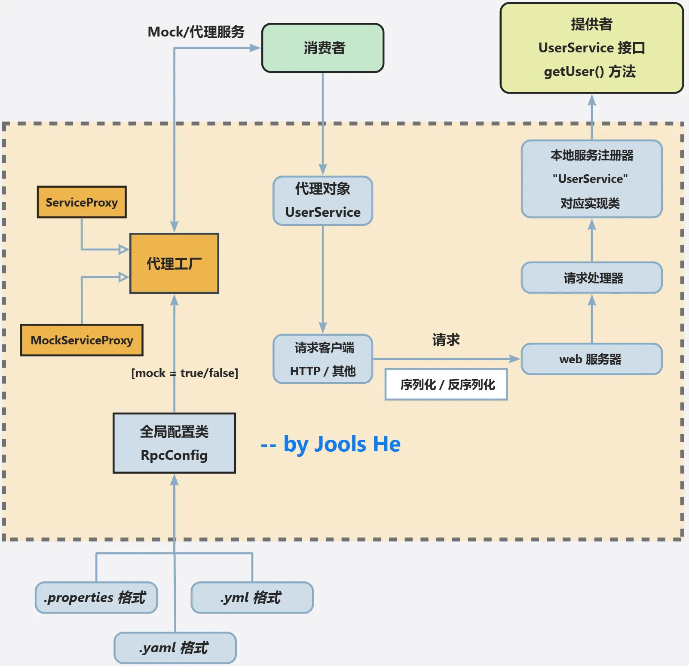

### 阶段成果

- 接口 Mock 的需求分析和设计
- 支持基于配置开启接口 Mock
- 基于 JDK + JavaFaker 支持多种数据类型返回默认值
- 扩展 - 完善 Mock 机制，基于 JavaFaker 库

### Mock 机制简介

指模拟对象，通常用于测试代码中，特别是在单元测试中，便于跑通业务流程

### 为什么要支持 Mock

开发者能轻松调用服务接口、跑通业务流程，无需依赖真实远程服务，提升使用体验。

### 开发实现

`RpcConfig` 配置项新增 `mock (boolean 类型)`, 方便开发者快速开启

```java
public class RpcConfig {
    /**
     * 开启接口 mock, true 表示开启; false 表示关闭
     */
    private boolean mock = false;
}
```

借助动态代理，返回 `mock` 代理服务 `MockServiceProxy`，针对指定返回类型返回模拟数据
服务代理工厂 `ServiceProxyFactory` 支持返回 `mock` 代理服务实体

```java
@SuppressWarnings("all")
public static <T> T getMockProxy(Class<T> mockClass) {
    return (T) Proxy.newProxyInstance(
            mockClass.getClassLoader(),
            new Class[]{mockClass},
            new MockServiceProxy()
    );
}
```

### (扩展) - 完善 Mock 机制

基于 JavaFaker 支持 `mock` 更多种数据类型。

```xml
<dependency>
  <groupId>com.github.javafaker</groupId>
  <artifactId>javafaker</artifactId>
  <version>1.0.2</version>
</dependency>
```

**快速入门 - 测试方法**

1. 测试 `internet()` 相关 API，模拟域名 + IP
2. 测试 `bothify()` 方法，`?` 支持替换为随机字母；`#` 支持替换为随机数字
3. 测试 `address()` 方法，返回模拟地址数据

新增支持 Mock 的数据类型：

- 增加 RpcRequest / RpcResponse
- 增加 RpcConfig
- 增加 HttpServer

---

## 阶段 04 - 序列化器与 SPI 机制

### 阶段成果

- 支持多种序列化器实现方式 `JDK + JSON + Kryo + Hessian` 实现序列化器
- `扩展`- 实现 `Protobuf` 序列化器，支持 `RpcConfig` 默认配置和 SPI 配置
- `优化`- 基于静态内部类方法实现 `懒汉式 - 单例模式`创建序列化工厂
- `优化`- 基于 `双重检验锁校验机制`实现 `懒汉式 - 单例模式`创建序列化工厂

简单示意图：

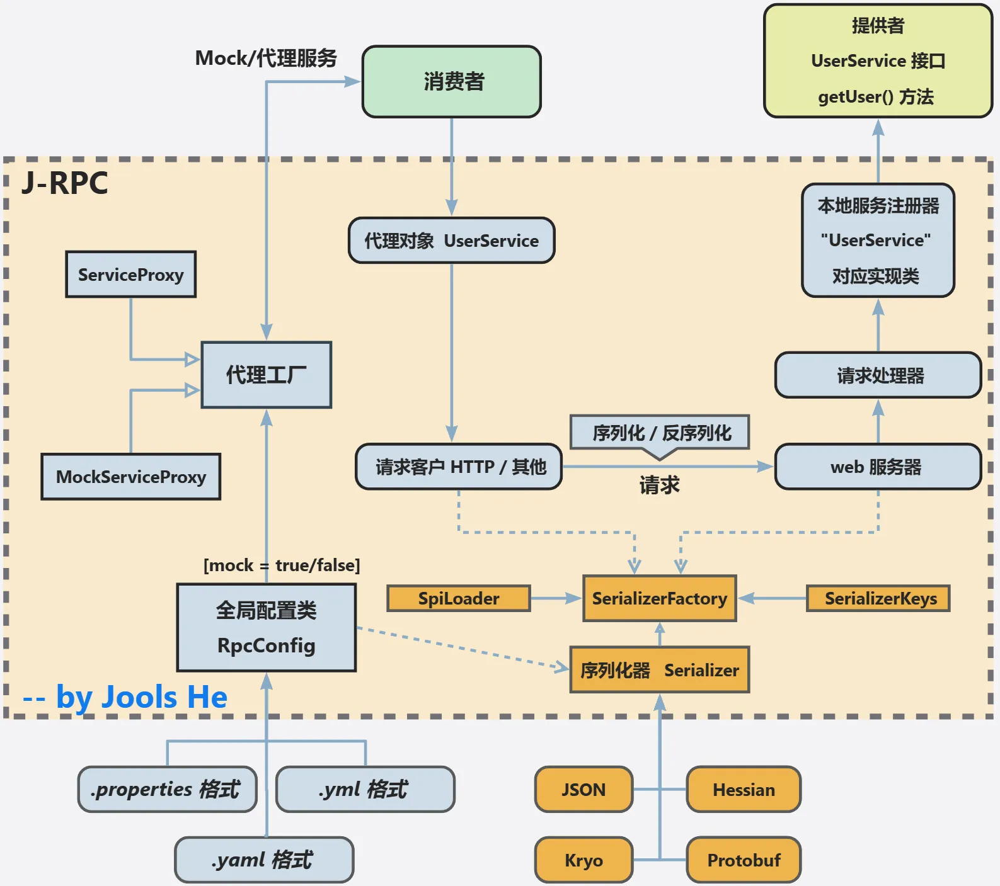

### 序列化器实现方式比较

| 序列化器               | 优点                                                                                                     | 缺点                                                                                      |
| ---------------------- | -------------------------------------------------------------------------------------------------------- | ----------------------------------------------------------------------------------------- |
| 原生 Java Serializable | 1. 简单易用，便于Java应用中的对象持久化<br />2. 兼容性好，与Java语言及框架无缝集成，操作流畅             | 1. 性能差<br /> 2. 调试困难 <br />3. 无版本控制，类结构调整易引发反序列化问题或数据不一致 |
| JSON                   | 1. 易读性好，可读性强，便于人类理解和调试<br />2. 跨语言支持广泛                                         | 1. 序列化后的数据量较大<br />2. 在处理复杂数据结构和循环引用时能力较弱                    |
| Hessian                | 1. 二进制序列化数据量小，传输效率高<br />2. 支持跨语言，适合分布式系统服务调用                           | 1. 性能较JSON略低<br />2. 对象必须实现Serializable接口                                    |
| Kryo                   | 1. 高性能，序列化和反序列化速度快<br />2. 支持循环引用和自定义序列化器 <br />3. 无需实现Serializable接口 | 1. 不跨语言，只适用于Java<br />2. 对象的序列化格式不够友好                                |
| Protobuf               | 1. 高效的二进制序列化，序列化后的数据量极小<br />2. 跨语言支持 <br />3. 支持版本化和向前/向后兼容性      | 1. 配置相对复杂，需要先定义数据结构的消息格式<br />2. 对象的序列化格式不易读懂            |

### SPI 机制

SPI (Service Provider Interface) 是 Java 中的一种机制，用于支持模块化开发和插件扩展。它允许服务提供者通过配置文件注册实现，系统通过反射动态加载这些实现。

### 实现

新建包 com.jools.joolsrpc.serializer 存放所有序列化器相关

- 实现 `JsonSerializer` 基于 jackson-databind
- 实现 `KryoSerializer`，基于 kryo 和 ThreadLocal 保证每个线程有一个单独的 Kryo 对象实例
- 实现 `HessianSerializer`, 基于 hessian 版本 4.0.66
- 接口 `SerializerKeys` 列举所有支持的序列化器 Key

### 序列化器工厂实现方案一：简单工厂

基于 Map 存储 `SerializerKeys` -> `Serializer` 的映射关系，默认使用 JDK。支持基于 key 查询 Map 返回相应的序列化器实例

扩展 `RpcConfig`，支持配置指定序列化器

```java
public class RpcConfig {
    private String serializer = SerializerKeys.JDK;
}
```

优化提供者基于工厂和配置类获取指定序列化器

```java
final Serializer serializer = SerializerFactory.getInstance(RpcApplication.getRpcConfig().getSerializer());
```

### 序列化器工厂实现方案二：自定义 SPI 机制

自定义 SPI 机制的扫描路径 `/resources/META-INF/rpc/`

- `custom` 子目录(用户自定义)
- `system` 子目录(配置系统自带设置)

`system` 子目录下配置：

```properties
jdk=com.jools.joolsrpc.serializer.impl.JdkSerializer
hessian=com.jools.joolsrpc.serializer.impl.HessianSerializer
json=com.jools.joolsrpc.serializer.impl.JsonSerializer
kryo=com.jools.joolsrpc.serializer.impl.KryoSerializer
```

编写 `SpiLoader` 加载器，关键属性：

- `Map<String, Map<String, Class<?>>> loaderMap`: `接口名 -> {配置键名, 实现类全类名}`
- `instanceCache`: `对象实例缓存, 存储全类名 -> 对象实例`
- `SPI_RPC_SYSTEM_DIR`: 默认读取的系统目录 `META-INF/rpc/system`
- `SPI_RPC_CUSTOM_DIR`：默认读取的用户自定义目录 `META-INF/rpc/custom`
- `SPI_LOAD_DIR`：需要扫描的所有目录 `{SPI_RPC_SYSTEM_DIR, SPI_RPC_CUSTOM_DIR}`

关键方法：

- `getInstance(Class<?> cls, String key)` 根据接口类名获取其支持的所有 key 标识，通过反射创建实例，并通过 `instanceCache` 缓存来确保单例
- `load(Class<?> loadClass)` 基于接口名，扫描所有 SPI 目录，读取文件内容，同时将其加入到 `loaderMap`

`SerializerFactory`初始化时，通过 `SpiLoader` 的 load 方法加载所有序列化器实现类。之后，使用 `getInstance` 方法获取特定的序列化器实例。

测试:

- 非法序列化器实现类全类名会导致反射生成实例失败
- 测试，获取非法 SerializerKeys例如 aa， 会获取失败
- 测试配置相同的key, 若实现类配置得不同，自定义配置会覆盖系统配置
- 测试支持基于 .properties/.yaml/.yml 配置可切换序列化器

### (扩展) - 实现 Protobuf 序列化器

```xml
<dependency>
  <groupId>com.google.protobuf</groupId>
  <artifactId>protobuf-java</artifactId>
  <version>3.21.12</version>
</dependency>
```

**实现步骤**：

1. 安装 ProtoBuf 编译器
2. 安装 IDEA 插件支持，插件名称 `Protobuf Generator`
3. 配置 IDEA 快速编译 GenProtobuf
   1. Tools->Configure GenProtobuf
   2. Protoc Path：安装 protoc 编译器的路径
   3. 构建 Java，生成 Protobuf 的路径
4. 实现 `Serializer` 接口，支持基于 Protobuf 的序列化器，测试
5. 扩展序列化器常量 `SerializerKeys`，添加 `PROTOBUF` 选项
6. `META-INF\rpc\system` 目录下新增 `protobuf = 实现全类名`
7. 测试 - 注册新序列化器
8. 测试 - 切换序列化器

### (扩展) - 序列化工厂修改为懒汉式单例

**1. 原理**

当外部类加载时，并不会立即加载静态内部类。只有在外部类访问静态内部类的方法或成员时，静态内部类才会被加载。

在使用静态内部类实现单例模式时，单例对象是静态内部类的一个静态成员。当外部类第一次调用获取单例对象的方法时，静态内部类会被加载，并创建单例对象。这样就实现了延迟加载，即在需要时才创建单例对象。

**2. 保证线程安全**

静态内部类的延迟加载有助于保证线程安全，并且单例对象仅在需要时才创建，从而降低了多线程环境下的竞争条件风险。

基于静态内部类实现：

```java
@Slf4j
public class SerializerFactory {
  
    private static class SerializerFactoryHolder {
        private static final SerializerFactory SERIALIZER_FACTORY = new SerializerFactory();
    }

    public static SerializerFactory getInstance() {
        return SerializerFactoryHolder.SERIALIZER_FACTORY;
    }
}
```

### (扩展) - 修改 SpiLoader 用懒加载获取实例

基于双重校验锁机制实现：

```java
public class SpiLoader {

    private SpiLoader() {
        log.info("Enter SpiLoader Class `private` Constructor....");
    }

    public static SpiLoader getSpiLoaderInstance() {
        if (spiLoaderInstance == null) {
            synchronized (SpiLoader.class) {
                if (spiLoaderInstance == null) {
                    spiLoaderInstance = new SpiLoader();
                }
            }
        }
        return spiLoaderInstance;
    }
}
```

---

## 阶段 05 - 注册中心实现

### 阶段成果

实现基于 Etcd 的注册中心，借助租约 (Lease)、监听 (Watch) 特性实现注册中心核心能力

#### 简单示意图

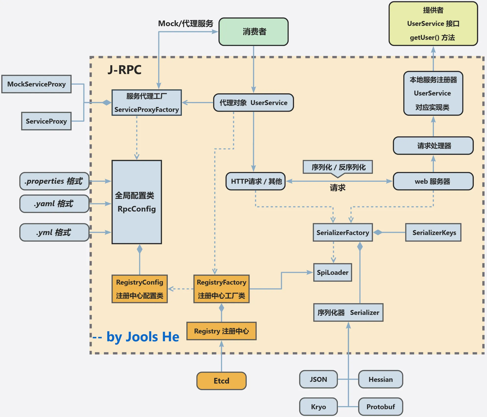

**新增类 - UML 图梳理**

注册中心相关：

- 通过 `SpiLoader` 机制加载注册中心配置
- 基于 `RpcConfig` 中的 `RegistryConfig` 获取到对应的 `RegistryKeys` 内配置的注册中心类型
- `Registry` 注册中心具体实现类 `EtcdRegistry` 完成服务注册、续期、监听机制
- 服务注册信息借助 `ServiceMetaInfo` 进行封装

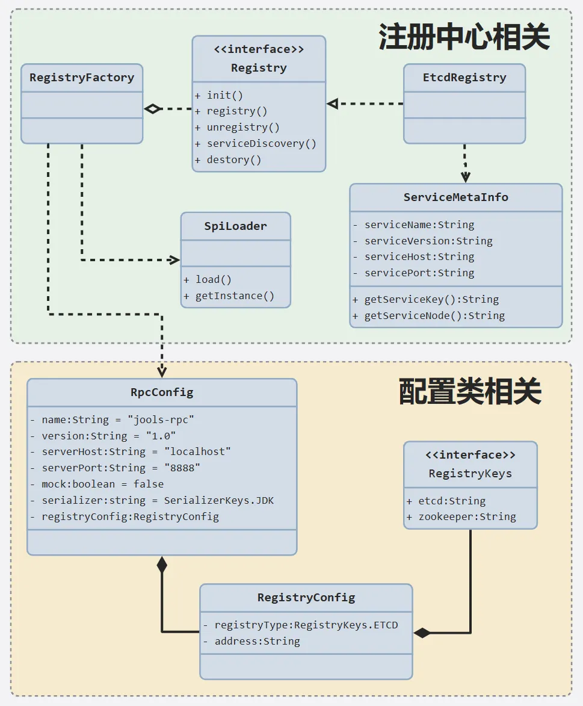

**注册中心示意图**

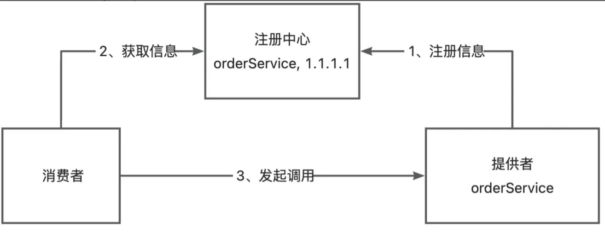

### 注册中心核心能力

1. 数据分布式存储：集中的注册信息数据存储、读取和共享
2. 服务注册：服务提供者上报服务信息到注册中心
3. 服务发现：服务消费者从注册中心拉取服务信息
4. 心跳检测：定期检查服务提供者的存活状态
5. 服务注销：手动删除节点、或者自动删除失效节点

### Etcd 核心特性

- Lease（租约）：用于对键值对进行 TTL 超时设置
- Watch（监听）：可以监视特定键的变化，触发相应的通知
- 强一致性：使用 Raft 一致性算法保证数据一致性

### Etcd 依赖

```xml
<dependency>
    <groupId>io.etcd</groupId>
    <artifactId>jetcd-core</artifactId>
    <version>0.8.2</version>
</dependency>
```

### 开发实现

- ServiceMetaInfo：封装服务的注册信息（服务名称、版本号、地址、分组）
- RegistryConfig：注册中心配置类
- Registry：注册中心接口，提供初始化、注册、注销、服务发现
- EtcdRegistry：Etcd 注册中心实现
- RegistryFactory：注册中心工厂，使用 SPI 动态加载
- RegistryKeys：注册中心常量

#### 步骤

1. 注册中心选型：Etcd；

   Go 语言实现的、开源的、分布式的键值存储系统，它主要用于分布式系统中的服务发现、配置管理和分布式锁场景
2. **注册中心核心能力：**数据分布式存储 + 服务注册 + 服务发现 + 心跳检测 + 服务注销 + 扩展（注册中心容错、服务消费者缓存）
3. Etcd 快速入门 + 核心数据结构 + 特性 + Raft 一致性算法
4. Etcd 安装 版本：3.5.16 + 启动 + 命令行基本操作（put + get + del）
5. Etcd 可视化工具安装 - `EtcdKeeper`
6. Etcd Java 客户端安装 `Jetcd` + `Jetcd` 快速入门
7. Jetcd 内常用客户端梳理，基于 `io.etcd.jetcd.Client` 获取

| 客户端名称        | 作用                                                                       |
| ----------------- | -------------------------------------------------------------------------- |
| KVClient          | 操作键值对：设置值、获取值、删除值、列出目录。                             |
| LeaseClient       | 管理租约：创建、续约、撤销租约，为键值对分配生存时间，自动删除过期键值对。 |
| WatchClient       | 监视键变化：实时监听键的变化并接收通知。                                   |
| ClusterClient     | 管理集群：添加/移除成员，获取健康状态和成员列表，执行选举操作。            |
| AuthClient        | 身份验证：管理用户、角色等权限信息，授予或撤销权限。                       |
| MaintenanceClient | 维护操作：健康检查、数据备份、快照、压缩、成员维护等。                     |
| LockClient        | 分布式锁：创建、获取、释放锁，实现并发控制。                               |
| ElectionClient    | 分布式选举：创建选举、提交选票、监视选举结果。                             |

**存储结构设计**

要点：一个服务可能有多个服务提供者(负载均衡)

1. 层级结构（比如 Etcd）

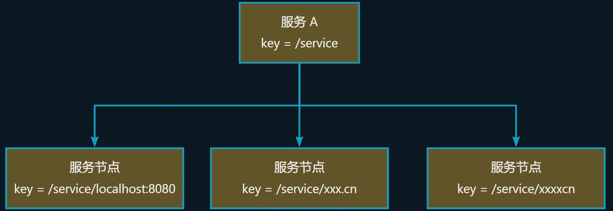

2. 列表结构（比如：Redis 中的 List 数据结构）

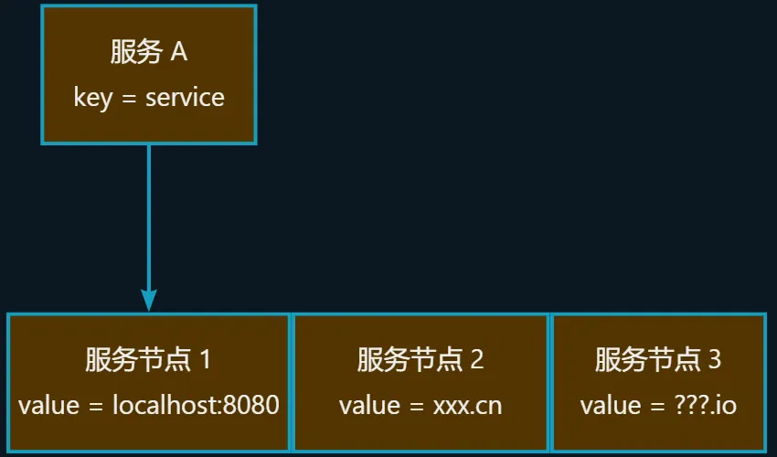

**代码实现**

1. 定义服务注册信息类 `ServiceMetaInfo` 封装注册信息包括：服务名称 + 服务版本号 + 服务地址 + 服务分组
2. 支持获取服务注册键名 - 格式：`serviceName:serviceVersion`
3. 支持获取服务注册节点键名 - 格式：`serviceName:serviceVersion:IP:Port` 方便注册
4. 扩充 `RpcConstant` 和 `RpcRequest` 新增服务版本号字段 `serviceVersion`
5. 新增注册中心配置类 `RegistryConfig`，维护注册中心配置
6. 支持全局配置 `RpcConfig` 持有 `RegistryConfig` 实例；默认实现为 Etcd
7. 新增注册中心接口 `Registry`，定义核心功能方法

   1. 初始化 `init(RegistryConfig registryConfig)`
   2. 注册服务：基于服务注册信息 `ServiceMetaInfo` 构建注册节点信息 `/rpc/serviceName:serviceVersion/serviceHost:servicePort`
   3. 注销服务 `unRegistry(ServiceMetaInfo serviceMetaInfo)`
   4. 服务发现 `serviceDiscovery(String serviceKey)`（获取服务节点列表）：基于服务注册信息构建查询服务的 key `/rpc/serviceName:serviceVersion`
   5. 服务销毁 `destory()`
8. 基于 Etcd 实现注册中心接口 `EtcdRegistry`
9. 新增注册中心常量 `RegistryKeys` 类，key 标记注册中心类型 `ETCD="etcd"`，默认支持 etcd
10. 实现基于自定义 SPI 机制配合 `SpiLoader` 实现的简单工厂模式的 `RegistryFactory`
11. 自定义 SPI 资源目录下新增关于注册中心的实现，默认 etcd
12. 扩充代理类的实现逻辑，通过配置 `RpcConfig` 获取 `RegistryConfig` 实例构建 HTTP 向注册中心发送服务发现请求；向服务发现结果发送请求并响应结果
13. 测试 - Provider 注册服务 + 启动消费者实现 RPC 请求调用 + 成功相应结果

### 流程梳理

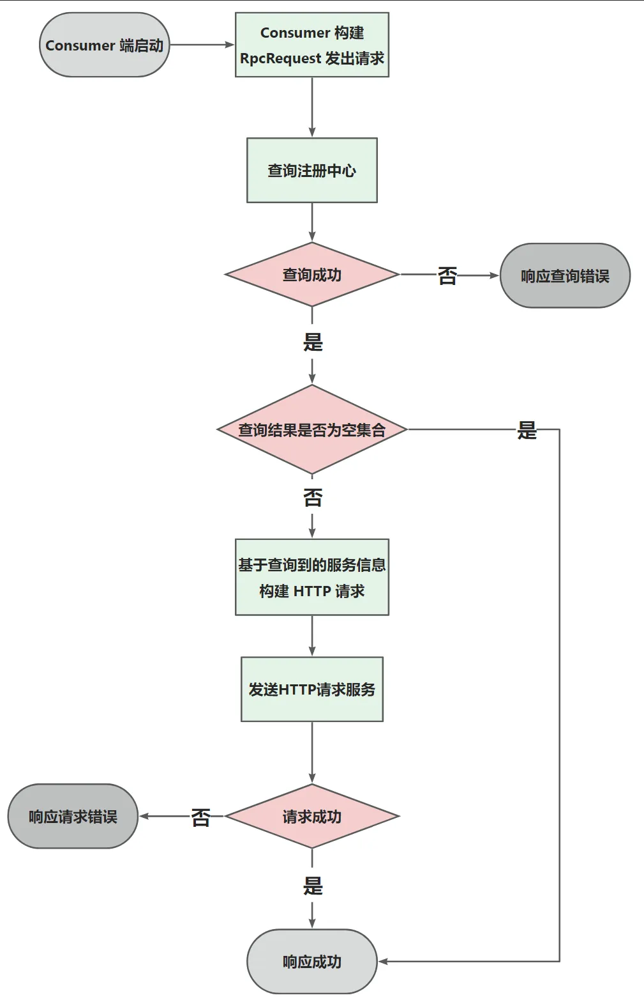

---

## 阶段 06 - 注册中心优化

### 阶段成果

- 心跳检测和续期机制
- 服务节点下线机制
- 消费端服务缓存
- 基于 ZooKeeper 的注册中心实现

### 心跳检测和续期机制

1. Etcd 注册中心实现心跳检测和续期机制
2. 实现服务节点下线后清除注册信息缓存
3. 添加注册中心服务信息缓存机制
4. 实现基于 ZooKeeper 的注册中心
5. (优化) 完善注册信息，扩展更多字段，增加：

   1. `registerTime` 节点注册时间
   2. `startTime` 节点启动时间
   3. `protocol` 服务通信协议，比如可扩展：HTTP、HTTPS、gRPC 等
   4. `serviceWeight` 服务权重，用于后期实现权重轮询
   5. `metadata` 自定义元数据，支持未来扩展
6. (优化) 实现支持 Redis 作为注册中心
7. (优化) 构建 Etcd 集群
8. (优化) 采用策略模式实现 key 监听
9. (优化) 增加消费者端缓存，实现服务注册信息失效兜底策略

### 示意图

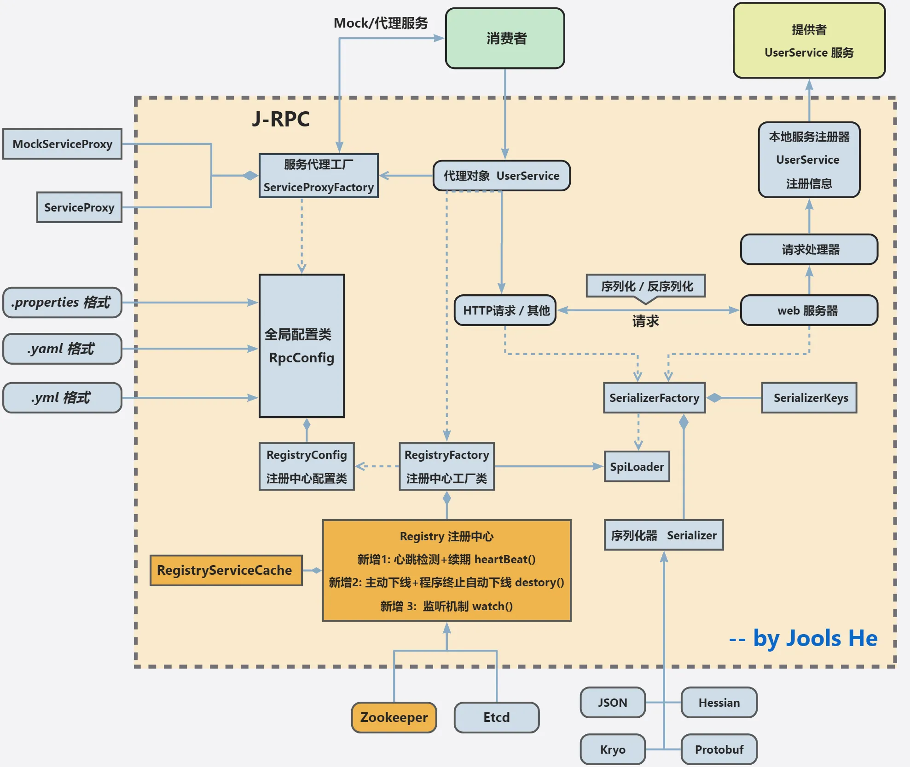

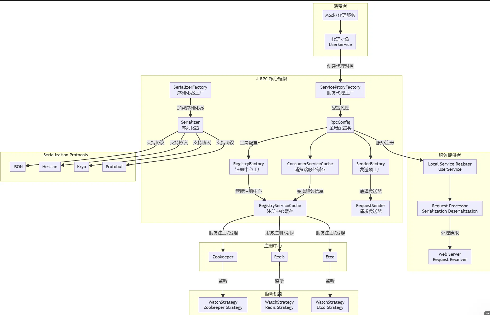

### 服务节点下线机制

- 主动下线：JVM ShutdownHook，项目正常退出时执行 destroy 方法
- 被动下线：利用 Etcd 的 key 过期机制自动移除

### 消费端服务缓存

- RegistryServiceCache：本地缓存服务节点信息
- 优先从缓存获取，无缓存再查注册中心
- Etcd Watch 监听机制：key 变更时即时更新缓存
- ConcurrentHashSet 防止重复监听同一个 key

### ZooKeeper 注册中心实现

```xml
<dependency>
    <groupId>org.apache.curator</groupId>
    <artifactId>curator-x-discovery</artifactId>
    <version>5.6.0</version>
</dependency>
```

### 开发实现

**优化 Etcd 作为注册中心实现**

**实现心跳续期**

思路：

1. Provider 向 Etcd 注册的时候，设置 TTL，过期之后自动删除该服务信息
2. Provider 定时请求 Etcd 续签自己的注册信息，更新 TTL

实现：

1. Registry 新增 `heartBeat` 心跳检测
2. 借助 Hutool 工具类中的 `CronUtil` 实现定时任务，对所有查询到的注册节点信息进行重新注册

**实现服务节点下线**

下线方案分类

1. 主动下线：服务提供者项目正常退出时，从注册中心移除注册信息。
2. 被动下线：服务提供者项目异常退出，利用 Etcd 的 key 过期机制自动移除。

实现：

1. 借助 JVM 的 ShutdownHook：Java 虚拟机提供的机制，可让开发者在 JVM 即将关闭时执行清理工作或必要操作，如关闭数据库连接、释放资源、保存临时数据。
2. 在 Registry 实例启动时 init 方法内创建并注册 Shutdown Hook，实现 JVM 退出的时候主动下线

**实现服务注册信息缓存**

**思路：**多服务，需要基于本地 JVM Map 集合实现；其中 `serviceKey` 作为 key；查询到的 `List<ServiceMetaInfo>` 作为 value

实现：

1. 实现操作缓存的方法，包括：写缓存 `writeCache`、读缓存 `readCache`、清空缓存 `clear`
2. 在 registry 包下新增缓存类 `RegistryServiceCache`
3. 注册中心实现 `EtcdRegistry` 添加 `RegistryServiceCache` 字段
4. 修改服务发现 `serviceDiscovery` 方法：先读缓存，后查询更新缓存

**实现监听机制**

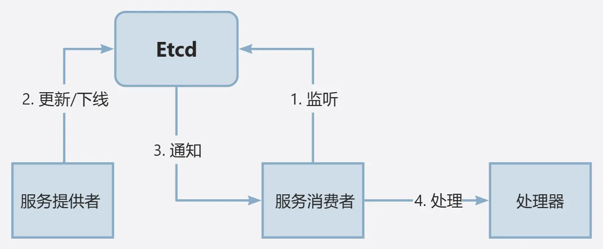

实现：

1. `EtcdRegistry` 注册中心实现类实现 `watch(String serviceKey)` 中，新建监听 key 的集合；可以使用 `ConcurrentHashSet` 防止并发冲突
2. `EtcdRegistry` 内借助 Jetcd 的 `watchClient` 监听 `WatchEvent`
3. 当 Event 为 DELETE 则实现清除服务缓存

**问题与解决**

**报错 - 删除缓存失败**

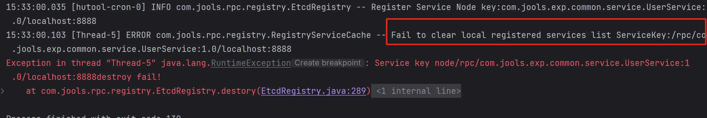

1. 修复 - 键名添加到缓存时没有携带 `/rpc/` 前缀 watch 基于 `ServiceNodeKey(serviceKey/ip:port)`

```java
// 解析服务名称
List<ServiceMetaInfo> serviceMetaInfos = keyValueList
    .stream()
    .map((kv) -> {
        // 监听 key
        String key = kv.getKey().toString(StandardCharsets.UTF_8);
        // 监控 serviceNodeKey
        watch(key);
        String value = kv.getValue().toString(StandardCharsets.UTF_8);
        // 映射成 ServiceMetaInfo
        return JSONUtil.toBean(value, ServiceMetaInfo.class);
    }).collect(Collectors.toList());
```

2. 监听机制清除注册服务缓存时要基于 `serviceKey` (`/rpc/全类名:version`) 作为 key 清除
3. 清空缓存时需要添加 `ETCD_ROOT_PATH` (`/rpc/`)前缀，作为缓存的 key

**实现 Zookeeper 作为注册中心**

**参考文档**

- Zookeeper 官方手册
- Linux - 安装 Zookeeper
- Window 下安装 Zookeeper

**Java 操作 ZooKeeper 的客户端 Curator**

**参考文档**

- Curator - 示例代码仓库
- Curator - 快速入门

1. 基于 Curator 实现注册中心的核心功能：服务发现 `serviceDiscovery` + 监听 `watch` + 注册 `registry` + 下线 `unRegistry` + 销毁 `destory`
2. 服务注册之前，需要借助 `createServiceInstance()` 建造者模式将 `ServiceMetaInfo` 封装为 `ServiceInstance`
3. Zookeeper 也实现服务注册信息缓存
4. 扩充 SPI 资源目录内容，新增关于 ZooKeeper 的内容
5. 测试支持基于 `RpcConfig` 配置 `rpc.registryConfig.registryType` 项灵活切换注册中心

### 扩展

**(扩展) - 服务注册信息 ServiceMetaInfo 添加更多字段**

增加：

- `registerTime` 节点注册时间
- `startTime` 节点启动时间
- `protocol` 服务协议 - 明确定义服务的通信协议（如 HTTP、HTTPS、GRPC、Dubbo 等）
- `serviceWeight` 服务权重 - 权重字段 权重可选 0, 1, 2；后期用于负载均衡
- `metadata` 自定义元数据 - 支持未来扩展

**实现**

- 添加时间工具类 `DateUtils`
- 在 Provider 注册服务构建 `ServiceMetaInfo` 的时候设置通信协议（默认 HTTP）；注册时添加注册时间
- 基于简单工厂 `RequestSender`，实现支持基于 `protocol` 字段切换请求发送者；当前先实现基于 HTTP
- 修改构建代理实例的 `ServiceProxy`，基于请求得到的 `serviceMetaInfo` 内的 `protocol` 字段调用相应的 `RequestSender`

**(扩展) - 实现 Redis 作为注册中心**

**实现步骤：**

1. 实现 `Registry` 接口，基于 Jedis 实现 `RedisRegistry`
2. `init()` 方法：基于 ip + port 实例化一个 Jedis
3. `heartBeat()`：借助 Hutool CronUtil；支持秒级单位
4. `registry()`：基于 `SETNX` 指令实现注册，默认设置过期时间 TTL 为 30s
5. `serviceDiscovery()`：基于 `SCAN` 迭代返回基于服务名前缀查询到的所有服务节点信息；再基于 `GET` 操作基于查询详细的 `ServiceMetaInfo`
6. `unRegistry()`：删除本地服务节点注册信息和缓存
7. `destory()`：清空本地服务节点注册信息和缓存 + 停止心跳检测任务 `CronUtil.stop()`
8. `watch()`：独立线程进行订阅，基于 `psubscribe`；需要打开 Redis 事件监听配置 `config set notify-keyspace-events Ex`
9. 扩充 SPI 资源目录内容，新增支持 Redis 作为服务注册中心；
10. 测试支持基于 RpcConfig 配置项基于 `rpc.registryConfig.registryType` 灵活切换为 Redis 作注册中心

**(扩展) - 搭建 Etcd 集群**

**参考文档**

搭建 Window 下的 Etcd 集群

Etcd 官方 - How to Set Up a Demo Etcd Cluster

**(扩展) 策略模式实现注册中心 key 监听**

1. 定义 `WatchStrategy` 接口持有 `watch(String serviceNodeKey)`
2. 分别实现基于 Etcd、ZooKeeper、Redis 的监听机制

**(扩展) 服务注册信息失效(过期)兜底策略 - 建立消费端缓存服务信息**

**实现**

1. 新建 `ConsumerServiceCache` 类，持有 List 集合，消费端缓存兜底的注册信息 `ServiceMetaInfo`
2. 读缓存逻辑：当 `serviceDiscovery()` 查询信息为空则尝试读消费端缓存的服务信息。如果缓存为空，返回默认服务节点信息
3. 写缓存逻辑：如果 `serviceDiscovery()` 查询不为空，则更新缓存；

### 扩展后示意图

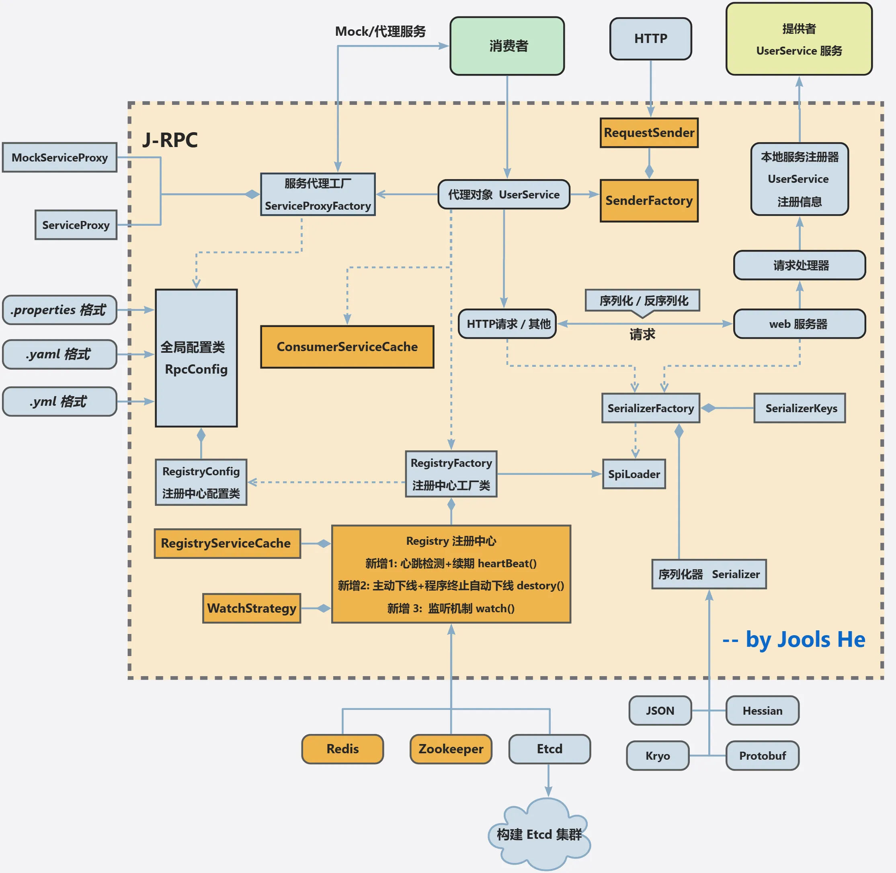

**可扩展点**

1. 实现支持更多协议的请求 HTTPS + gRPC + UDP + Dubbo 等（后续已经实现基于 TCP）
2. 处理逻辑 —— 如果服务注册信息携带元数据 MetaData
3. 尝试搭建 ZooKeeper、Redis 集群
4. 服务注册信息兜底 —— 添加更完备的兜底服务（比如真实的 IP + port）

---

## 阶段 07 - 自定义协议

### 阶段成果

1. 目标，用更少的空间传递必要的信息。基于 TCP 的更高效、简洁且灵活的RPC框架。
2. 定义自定义的RPC消息体结构 `ProtocolMessage`。
3. 开发针对该自定义消息体结构的编码器和解码器。
4. 将请求处理器升级为支持TCP加自定义消息体，并通过编码/解码器来处理消息收发与解析。
5. 采用Vert.x的RecordParser解决TCP传输中的半包或粘包问题。
6. 利用装饰器模式实现（TcpBufferHandlerWrapper）增强客户端和服务端的消息处理能力。
7. (扩展) - 优化 RequestSenderFactory，支持基于 SPI 机制加载相应协议的发射器，支持自定义扩展

### 示意图

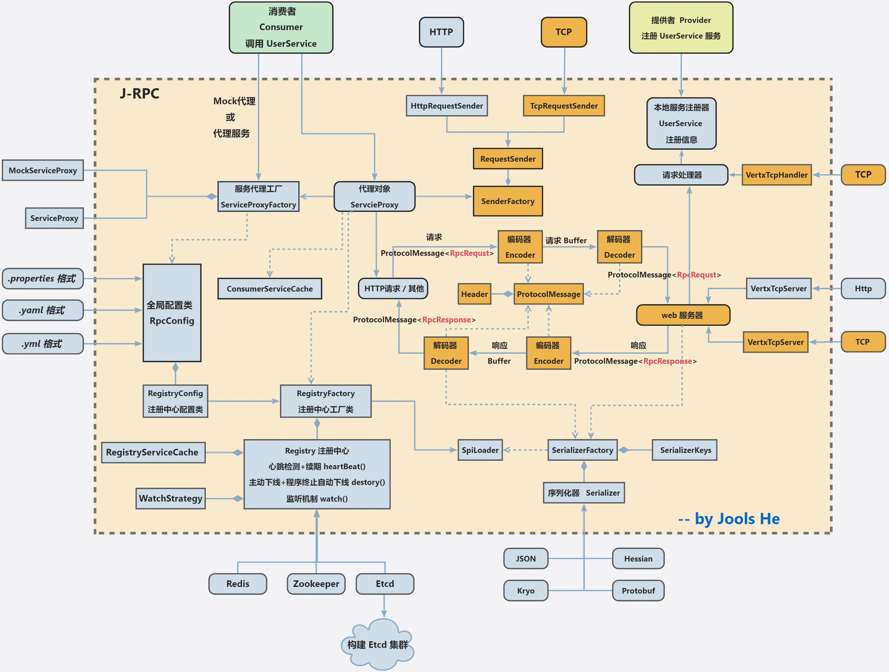

**解码器 + 编码器** 工作流程

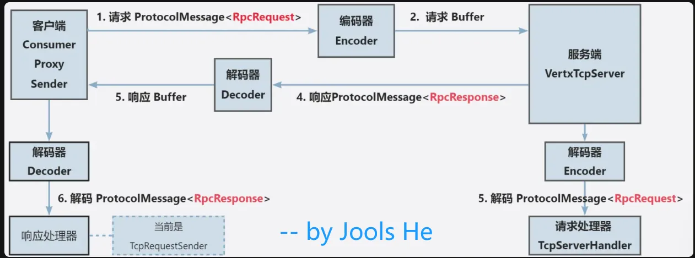

**自定义消息体ProtocolMessage 类图**

借助Lombok 的 `@Builder`注解

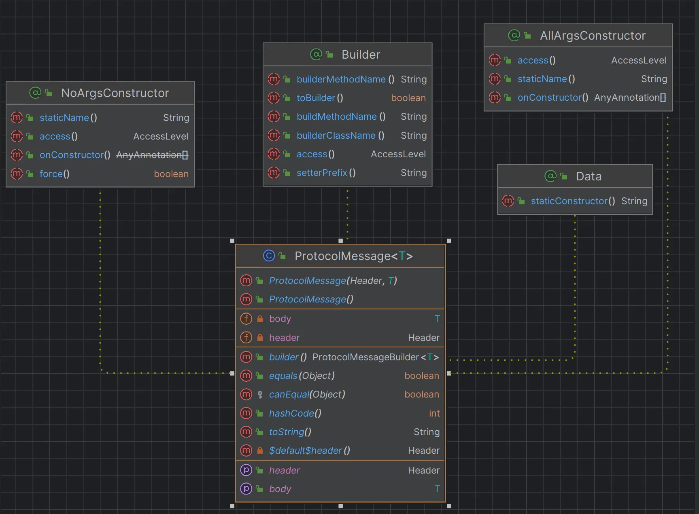

### 消息结构设计（消息头总长17字节）

| 字段           | 长度  | 说明           |
| -------------- | ----- | -------------- |
| 魔数           | 1字节 | 安全校验       |
| 版本号         | 1字节 | 协议版本       |
| 序列化方式     | 1字节 | 指定序列化器   |
| 类型           | 1字节 | 请求/响应/心跳 |
| 状态           | 1字节 | 响应结果状态   |
| 请求ID         | 8字节 | 唯一标识请求   |
| 请求体数据长度 | 4字节 | 解决粘包半包   |
| 请求体         | N字节 | 实际传输数据   |

**设计消息体结构如图所示**


**3.解决：TCP 本身存在的 半包 / 粘包问题**

1. 消息头中新增字段，标记 请求体数据长度；保证能够完整地获取 body 内容信息
2. 而消息头是固定长度的：17 个字节（见上文中的消息结构设计）
3. 因此可以通过消息头获取到应该截取的请求体长度
4. 设计优势：不需要基于 k - v 形式携带消息，不需要借助字符串作为建，而是直接按照字节截取(比如前 8 bit)就能够获取到

### 开发实现

**实现自定义消息体 + 协议**

1. 定义自定义TCP协议消息体 `ProtocolMessage`，包括消息头及其字段。
2. 创建协议常量 `ProtocolConstant`，提供默认的消息字段值。
3. 构建消息状态枚举 `ProtocolMessageStateEnum`，解析消息体内携带的 `messageState` 涵盖请求成功 2xx、请求失败 4xx 和响应失败 5xx 等状态。
4. 设计消息类型枚举 `ProtocolMessageTypeEnum`，解析消息体携带的 `messageType` 涵盖请求 Request, Response, Heartbeat等，其中键为 Byte 类型，值为字符串。
5. 设计消息序列化类型枚举 `ProtocolSerializerTypeEnum`，用于解析消息体携带的 `serializerType` 字节区间，其键 Byte 类型，值为字符串。
6. 基于 Vert.x 框架实现 TCP 服务端 `VertxTcpServer` 与客户端处理器 `VertxTcpClient`。

**实现基于自定义消息题的编码 / 解码器**

**工作示意图**

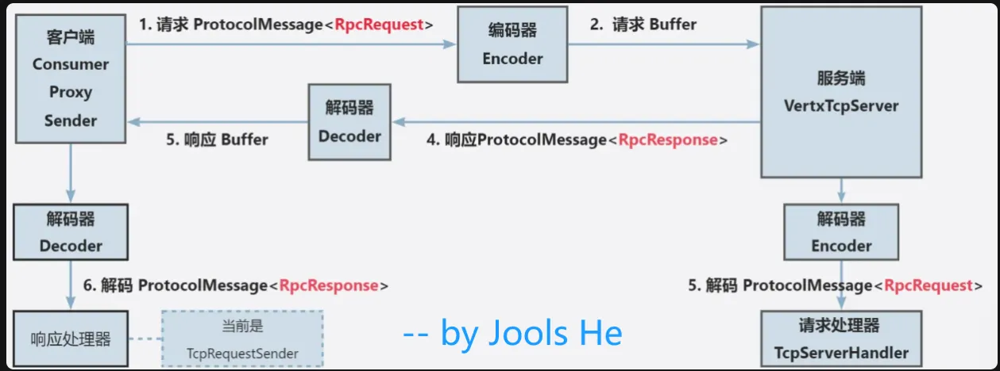

1. 实现消息编码器 `ProtocolMessageEncoder`：基于传入的 `ProtocolMessage` 实例构建字节数组的[消息头 + 消息体]，并根据序列化类型选择合适的序列化器进行数据序列化。
2. 实现消息解码器 `ProtocolMessageDecoder`：依据协议定义的 17 字节长度解析消息头，注意解析顺序需要和构造顺序一致，获取到消息体的大小解析主体内容。目前仅支持 REQUEST + RESPONSE 类型
3. 基于 Vertx 构建TCP请求处理器 `TcpServerHandler`，其功能包括：
   1. 接收并使用 `ProtocolMessageDecoder` 解码请求以获得 `RpcRequest` 对象，进一步获取请求的服务类名 `serviceName`、方法名 `methodName` 等信息。
   2. 根据解析的服务类名 `serviceName` 结果查找服务注册表并通过反射调用对应方法。
   3. 将响应结果封装成 `RpcResponse` 并通过 `ProtocolMessageEncoder` 编码后返回给客户端。
4. 修改消费者端的 `ServiceProxy`，支持基于 TCP 传输和解码编码
5. 扩展通信协议选项，增加对TCP的支持；引入简单工厂模式以便根据协议类型（如 HTTP 或 TCP）获取对应的请求发送器（`HttpRequestSender` 或 `TcpRequestSender`）。

**解决 TCP 存在的半包粘包问题**

思路：在消息头中设置请求体的长度，基于规定的长度截取消息头；在根据消息头内的长度截取消息头

- ProtocolMessage：协议消息类，包含消息头和消息体
- ProtocolConstant：协议常量类
- ProtocolMessageEncoder/Decoder：编码/解码器
- VertxTcpServer/Client：TCP 服务器/客户端
- TcpServerHandler：TCP 请求处理器
- TcpBufferHandlerWrapper：使用 RecordParser 解决粘包半包

### 粘包半包问题解决

思路：在消息头中设置请求体的长度，基于规定的长度截取消息头；在根据消息头内的长度截取消息头

1. 借助 `RecordParser` + 装饰器模式
2. `RecordParser` 先完整获取前 17 Byte 长度的消息头结构
3. 再根据请求头的解析到的消息体长度 `bodySize` 长度更改 `RecordParser` 的固定长度

- Vert.x RecordParser 保证读取特定长度的字符
- 装饰者模式增强 Handler 能力
- 分两次读取：先读固定长度头，再根据头中长度读变长体

---

## 阶段 08 - 负载均衡

### 阶段成果

- 实现轮询、随机、一致性 Hash 三种负载均衡算法
- 支持配置和扩展负载均衡器

### 示意图

**核心部分**

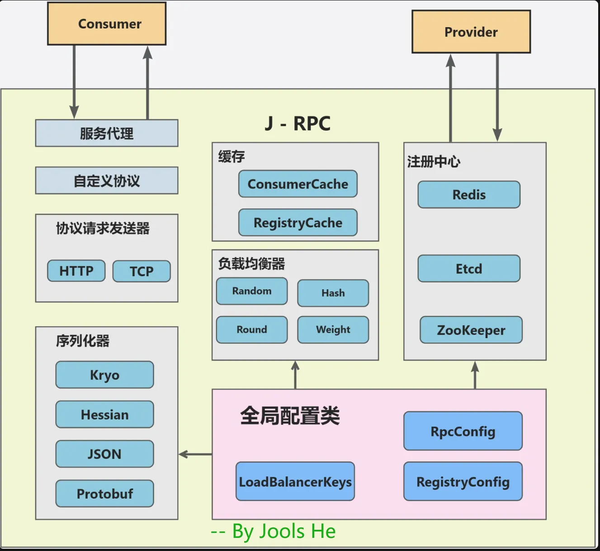

**简示图**

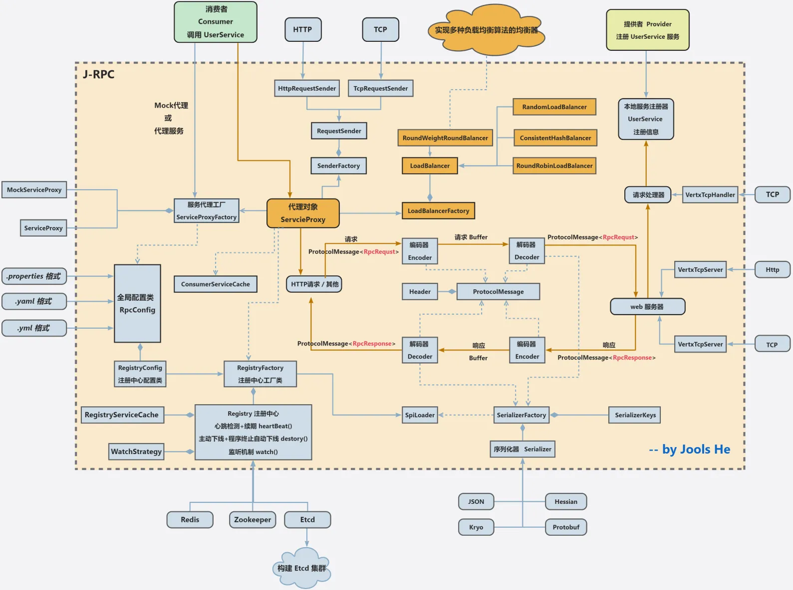

**类图 - 负载均衡策略类图**

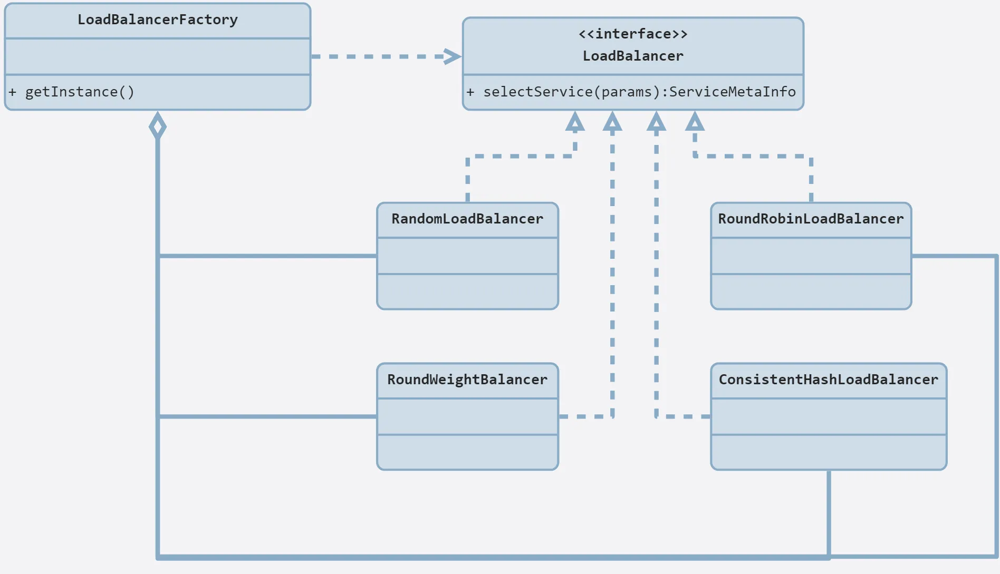

### 常见负载均衡算法

1. 轮询（Round Robin）：按顺序循环分配请求
2. 随机（Random）：随机选择服务器
3. 加权轮询/随机：根据权重分配请求
4. 最小连接数：选择当前连接最少的服务器
5. IP Hash：同一客户端请求始终分配到同一服务器

### 一致性 Hash

- 环状哈希值空间结构
- 解决节点下线：节点下线后负载平均分摊到其他节点
- 虚拟节点：解决倾斜问题，使分布更均匀

### 开发实现

- LoadBalancer：负载均衡器接口
- RoundRobinLoadBalancer：轮询（AtomicInteger 原子计数器）
- RandomLoadBalancer：随机（Random 类）
- ConsistentHashLoadBalancer：一致性 Hash（TreeMap 实现哈希环）
- LoadBalancerFactory：工厂 + SPI 动态加载
- LoadBalancerKeys：负载均衡器常量

**代码实现**

1. 入门了解一致性哈希负载均衡：原理、特性及优势。
2. 开发基础负载均衡器：基于 `AtomicInteger` 实现轮询 `Round`；基于 `Random` 实现随机 `Random` 策略。
3. 实现一致性哈希负载均衡器 `ConsistentHash`：
   - 使用TreeMap存储节点。
   - 节点选择规则：优先选取大于或等于请求哈希值的最近节点；若无，则返回环节点。
4. 定义 `LoadBalancerKeys` 接口，管理负载均衡类型常量，并通过工厂模式支持SPI机制。
5. 在自定义SPI资源中配置负载均衡选项，允许用户/开发者修改 `RpcConfig` 文件来切换不同的负载均衡策略。
6. 更新消费端 `ServiceProxy` 代码以利用负载均衡器获取服务节点。
7. 设置多个具有不同端口的服务提供者（Provider），并启动这些服务以测试负载均衡效果。

### 扩展

**(扩展) - 优化一致性负载均衡器；基于 Guava 的 `MurmurHash()` 实现**

参考文献：Java 基于 TreeMap 实现一致性 Hash

选择 Guava 包下的 `MurmurHash()` 算法

- 针对每个服务节点 hash( IP + Port )
- 这意味着相同的请求会被路由到同一个虚拟节点(从而映射到同一个真实服务节点)

**(扩展) - 实现 加权轮询 负载均衡算法**

参考文献：各种负载均衡算法实现

**实现：**

1. 目标：实现加权轮询方法 `RoundWeight`
2. 基于之前在 `ServiceMetaInfo` 内扩充的 `ServiceWeight` 字段；默认权重为 1
3. 新增 `ServiceWeight` 接口存储权重常量
4. 权重计算逻辑：
   - 计算所有服务节点的权重总和 `totalWeight`
   - 每次选取服务节点之前，遍历各个节点，选取最大权重
   - 之后更新被选中的节点为 `currentWeight - totalWeight`
   - 每次请求之后所有节点的权重累加上自身权重，但是总权重不变
   - 这样可以防止权重高的节点连续多次被选中，为其他节点留出机会。
5. 实现 `LoadBalancer` 接口，基于权重计算逻辑实现加权轮询负载均衡器
6. 每次负载均衡选取完服务节点后，需要更新各个服务节点的权重，借助 `RegistryServiceUpdater`
   1. `RegistryServiceUpdater` 借助 [线程池 + CompletableFuture] 实现服务节点的重新注册
   2. 测试算法以及每轮的权重更新

---

## 阶段 09 - 重试机制

### 阶段成果

1. 了解重试机制：重试机制触发条件 + 重试时间 + 停止重试策略 + 重试工作
2. 了解常用的重试时间策略：
   1. 固定重试间隔 (Fix Retry Interval)
   2. 递增避退重试 (Increment Wait)
   3. 指数避退重试 (Exponential Backoff Retry)
   4. 随机延迟重试 (Random Delay Retry)
   5. 可变延迟重试 (Variable Delay Retry)
3. 了解 Google 的 `Guava - Retrying` 工具
4. 代码实现：不重试策略 + 固定时间间隔重试策略
5. 优化：基于工厂模式 + SPI 机制，支持基于配置灵活切换重试策略
6. (扩展)- 支持实现 [间隔递增避退] + [间隔指数递增避退] + [间隔随机避退]

---

- 实现不重试、固定重试间隔两种重试策略
- 支持配置和扩展重试策略

### 示意图

**核心部分**

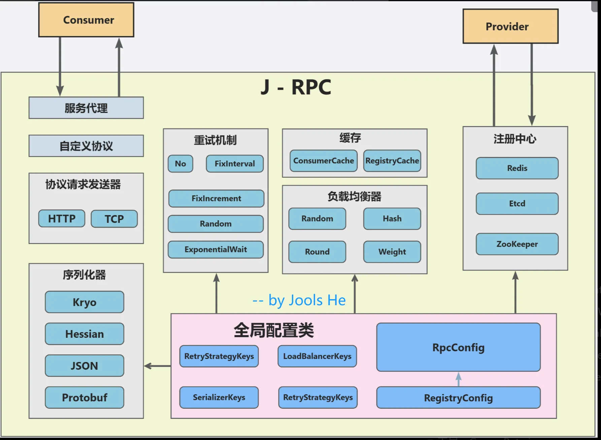

### 重试策略核心要素

1. 重试条件：网络异常等临时性问题
2. 重试时间算法：固定间隔、指数退避、随机延迟、可变延迟
3. 停止条件：最大尝试次数、超时停止
4. 重试工作：重复执行任务、告警、降级

### Guava-Retrying 依赖

```xml
<dependency>
    <groupId>com.github.rholder</groupId>
    <artifactId>guava-retrying</artifactId>
    <version>2.0.0</version>
</dependency>
```

### 开发实现

- RetryStrategy：重试策略接口
- NoRetryStrategy：不重试
- FixedIntervalRetryStrategy：固定重试间隔（RetryerBuilder）
- RetryStrategyFactory：工厂 + SPI 动态加载
- RetryStrategyKeys：重试策略常量

**实现**

**快速入门 Guava - Retrying**

1. `RetryBuilder` 方法介绍：Retry + WaitStrategy + BlockStrategy + StopStrategy + AttemptTimeLimiter + RetryListener
2. 重试条件 - `Retry`
   - 根据执行结果 + 根据异常发生
3. 等待策略 - `WaitStrategy`
   - 固定时长 + 随机等待时长 + 递增等待时长 + 指数增长时长 + 斐波那契递增等待时长 + 异常等待时长 + 组合复合时长
4. 阻塞策略 - `ThreadSleepStrategy`
5. 停止策略 - `StopStrategy`
   - 永不停止 `NeverStopStrategy` + 指定最多重试次数 `StopAfterAttemptStrategy` + 指定最长重试时间 `StopAfterDelayStrategy`
6. 超时限制 - `AttemptTimeLimiter`
   - 不限制执行时间：`NoAttemptTimeLimit`
   - 限制执行时间为固定值：`FixedAttemptTimeLimit`
7. 重试监听器 - `RetryListener` 观察者模式，可以注册监听器

**基于上述工具实现重试**

9. 开发实现 - 不重试策略：直接执行 `call` 方法
10. 开发实现 - 固定间隔重试：重试条件(异常) + 等待策略（固定间隔）+ 停止策略（超过最大尝试次数后停止）+ 重试监听（输出当前重试次数）
11. 新建配置重试常量 `RetryStrategyKeys`
12. 新建重试策略工厂类 `RetryStrategyFactory` 支持通过 SPI 机制加载
13. `RpcConfig` 内新增配置项 `retryStrategy` 支持用户/开发者基于配置切换

### 扩展

**(扩展) - 实现递增避退重试策略**

基于 Retrying 工具集内的

- 等待策略 `WaitStrategy` 设置为 递增等待规则 `incrementingWait`
- 停止策略 `StopStrategy` 设置重试总数为：4

**规则设计**

| 起始间隔     | 3s            |
| ------------ | ------------- |
| 递增间隔     | 3s            |
| 重试停止策略 | 重试 3 次之后 |

**(扩展) - 实现指数避退重试策略**

基于 Retrying 工具集内的

- 等待策略 `WaitStrategy` 设置为 递增等待规则 `exponentialWait`
- 停止策略 `StopStrategy` 设置重试总数为：4

**规则设计**

| 起始间隔     | 1s            |
| ------------ | ------------- |
| 指数递增间隔 | 2 的幂次方    |
| 重试停止策略 | 重试 3 次之后 |

**(扩展) - 实现随机延迟重试策略**

基于 Retrying 工具集内的

- 等待策略 `WaitStrategy` 设置为 递增等待规则 `randomWait`
- 停止策略 `StopStrategy` 设置重试总数为：4

**规则设计**

| 最小间隔 | 4s  |
| -------- | --- |
| 最大间隔 | 16s |

---

## 阶段 10 - 容错机制

### 阶段成果

1. 了解常见的容错策略
2. 基于容错策略接口实现多种容错机制，支持基于 SPI 和配置文件灵活修改
3. 重试策略之后启用生效后使用容错策略处理
4. 容错策略实现：
   1. `Fail - Fast` 快速失败 (直接抛出相关异常)
   2. `Fail - Safe` 静默处理 (仅返回 RpcResponse)
5. (扩展) 实现 `Fail - Back` 失败自动恢复 (参考 Dubbo 的本地伪装服务)
6. (扩展) 实现 `Fail - Over` 故障转移 (基于 `ServiceDiscovery` 获取到所有服务节点后尝试访问其他服务节点)

---

- 实现 Fail-Fast 快速失败、Fail-Safe 静默处理容错策略
- 先重试再容错的方案

### 示意图

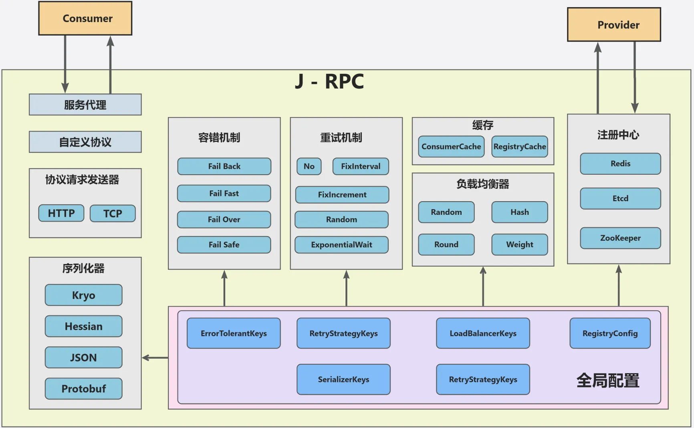

**重试策略设计UML**

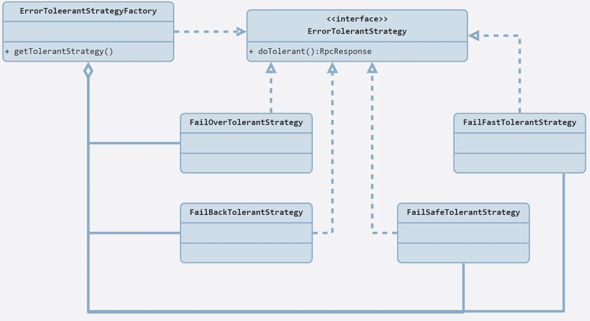

**负载均衡 + 重试策略 + 容错机制流程**

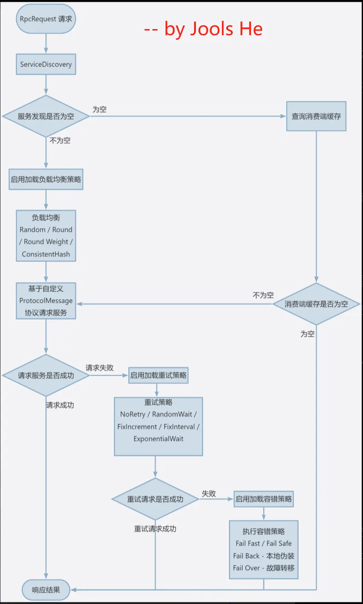

### 常用容错策略

1. Fail-Over 故障转移：失败后切换节点重试
2. Fail-Back 失败自动恢复：降级/重试/调用其他服务
3. Fail-Safe 静默处理：忽略非重要异常
4. Fail-Fast 快速失败：立刻报错交给外层处理

### 其他容错实现方式

- 重试：解决临时性异常
- 限流：保护系统压力过大
- 降级：牺牲质量保证部分功能可用
- 熔断：避免连锁故障
- 超时控制：防止阻塞和资源占用

### 开发实现

- TolerantStrategy：容错策略接口
- FailFastTolerantStrategy：快速失败，抛出异常
- FailSafeTolerantStrategy：静默处理，记录日志返回空响应
- TolerantStrategyFactory：工厂 + SPI 动态加载
- TolerantStrategyKeys：容错策略常量

**实现**

1. 常见的容错策略实现：`FailOver` 故障转移 + `FailBack` 失败故障恢复 + `FailSafe` 静默处理 + `FailFast` 快速失败
2. 常见的容错工作机制有：继续重试 + 限流 + 降级 + 熔断 + 超时控制
3. 定义重试机制接口 `ErrorTolerantStrategy`；各个容错策略实现该接口
4. 实现 `FailFast`：`FailFastTolerantStrategy` 直接抛出异常
5. 实现 `FailSafe`：`FailSafeTolerantStrategy` 遇到异常后返回一个相应对象 `RpcResponse`
6. 添加容错配置常量 `ErrorTolerantStrategyKeys` 列举所有支持的容错策略键名；支持基于配置 `RpcConfig` 灵活切换重试策略
7. 基于简单工厂模式实现 `ErrorTolerantStrategyFactory`；支持根据容错策略键名返回对象
8. 添加自定义 SPI 资源文件目录下，`RpcConfig` 新增配置项，支持基于配置切换
9. 修改消费端 `ServiceProxy`，应用容错策略。

### 扩展

**扩展 - 实现 FailBack 容错机制**

参考文档：

Dubbo - 服务讲解 - 本地伪装

Dubbo Mock 本地伪装示例代码

**服务容错 - 本地伪装**

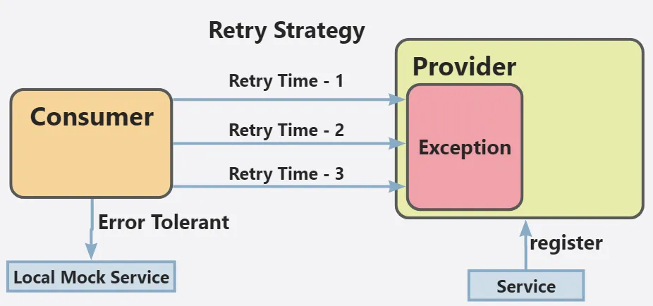

**实现：**

1. 消费者端实现 `UserService` 接口，作为本地的伪装服务。
2. 在消费者端的 `exp-consumer` 模块中，使用 `ConcurrentHashMap` 来维护一个本地的 Mock 服务注册中心（`LocalServiceMockRegistry`）。
3. 当重试策略完成后，采用 `FailBack` 策略来查询这个本地 Mock 服务注册中心。
4. 查询成功则返回结果；如果失败，则输出错误信息。
5. 将 `LocalServiceMockRegistry` 功能优化并迁移至 `rpc-core` 模块中。
6. 构建一个简单的消息队列。当重试机制失效时，启用容错机制，并把当前请求的信息放入队列尾部。
7. 在启用 FailBack 容错策略的情况下，消费端从队列中取出请求信息，并再次尝试通过本地 Mock 服务注册中心进行处理。

**流程梳理**

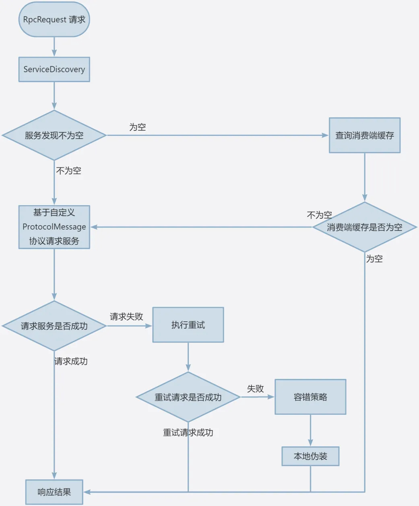

**(扩展) - 实现 FailOver 容错机制**

**思路**

- 通过 `serviceDiscovery` 获取多个服务节点。
- 当某个节点的重试策略失败时，切换到下一个服务节点。

**实现步骤**

1. 修改 `ServiceProxy`，利用 `ErrorTolerantStrategy` 接口定义的方法参数 `Map<String, Object> context` 传递以下信息：

   - `RpcRequest`：请求的服务信息
   - `selectedServiceMetaInfo`：已访问的服务节点信息
   - `serviceInfos`：所有可用的服务节点信息
   - `retryStrategy`：重试策略
   - `sender`：基于协议的请求发送者
2. 实现 `ErrorTolerantStrategy` 接口，定义 FailOver 逻辑以尝试下一个可用的服务节点。如果请求成功，则返回响应；否则继续尝试其他节点，直到所有节点都被尝试过为止。

   - 启动多个服务提供者，并将它们注册为相同名称的服务到注册中心。

**(扩展) - 基于注解驱动实现 FailBack 策略**

**注解设计**

`@JRpcFailBack` 设计 - 仅支持作用于属性字段 `@Target(ElementType.FIELD)`

1. `serviceName`：本地伪装的服务名（全类名）
2. `mock`：可以指定本地伪装实现类的全类名；如果未设置，默认选用第一个查询到的服务作为伪装服务

`@MockScanPackage` 设计

1. `basePackage`：指定扫描的包名，扫描注册该包下的所有伪装服务

**实现**

1. 优化本地伪装服务注册中心，使用 `ConcurrentHashMap` 存储服务类名和服务实现类列表。
2. 启动时，Consumer扫描标记了 `@MockScanPackage` 注解的包，并将这些类注册到 `LocalServiceMockRegister` 中。
3. 扫描所有带有 `@JRpcFailBack` 注解的字段，检查其服务是否支持本地伪装。
4. 若发现带 `@JRpcFailBack` 注解但未设置RPC框架为FailBack模式，则抛出错误。
5. 测试配置正确性，配置不当时报错。
6. 测试未注册伪装服务的情况。
7. 验证已注册的本地伪装服务能否正常工作。

**优化**

1. **问题分析**：当前仅支持默认调用首个配置的伪装服务（按照 `serviceDiscovery()` 查询到后存储在LocalServiceMockRegister中的顺序）。
2. **优化思路**：

   - 扩展 `@JRpcFailBack` 注解，添加 `mockServiceName` 字段指定本地伪装类全名。
   - `LocalServiceMockRegistry` 新增 `bindMockService` 方法来绑定特定 `mockServiceName` 与指定的伪装服务类。
   - 在扫描 `@JRpcFailBack` 注解时，如果 `mockServiceName` 非空，则建立服务类与指定伪装类之间的映射。
   - 容错触发时，根据 `serviceName` 查找对应的本地伪装服务类；若指定了伪装类则使用该指定类，否则使用列表中第一个服务作为默认。
3. **修改后的 `@JRpcFailBack` 注解包括**：

| 字段名          | 类型    | 说明                     | 默认值   |
| --------------- | ------- | ------------------------ | -------- |
| serviceName     | String  | 服务名称(全类名)         | 空字符串 |
| mockServiceName | String  | 本地伪装服务名称(全类名) | 空字符串 |
| mock            | boolean | 是否开启本地伪装机制     | false    |

4. **修改后的 `@MockScanPackage`**

| 字段名      | 类型   | 说明           | 默认值                     |
| ----------- | ------ | -------------- | -------------------------- |
| basePackage | String | 指定扫描的包名 | com.jools.exp.consumer.api |

5. 扩展 `LocalServiceMockRegistry` 支持为每个服务绑定一个特定的本地伪装服务。
6. **测试**：

   - 测试默认情况下的行为，即调用列表中的第一个服务。
   - 测试指定单一服务的情况。

---

## 阶段 11 - 启动机制和注解驱动

### 阶段成果

1. **注解设计**：`@EnableJRpc` + `@JRpcReference` + `@JRpcService`
2. 参考 Dubbo 为服务提供者和消费者写启动类并简化代码。用三大注解（`@EnableJRpc`、`@JRpcService`、`@JRpcReference`）。
3. 采用 Bean 监听机制，实现 `BeanPostProcessor` 接口，依注解执行服务注册和代理对象注入。
4. 基于 SpringBoot 的 RPC starter 模块，扫描启动类 `@EnableRpc` 注解，支持启动后基于注解驱动。

---

- 服务提供者/消费者启动类封装
- Spring Boot Starter 注解驱动开发

### 示意图

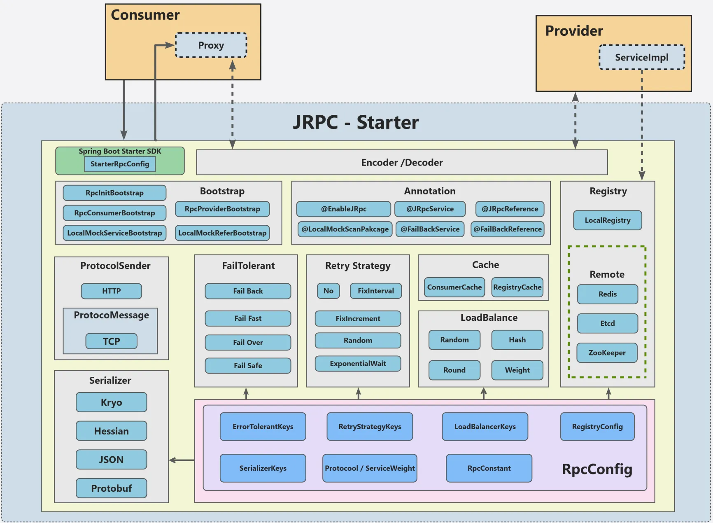

**设计的启动器类**

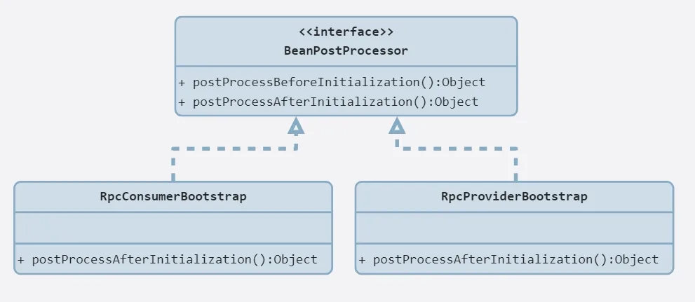

### 启动机制

- ProviderBootstrap：服务提供者启动类，封装初始化和服务注册
- ConsumerBootstrap：服务消费者启动类，执行通用初始化
- ServiceRegisterInfo：封装服务注册信息

### Spring Boot Starter 注解驱动

- @EnableRpc：全局启用 RPC，控制是否启动服务器
- @RpcService：服务提供者注解，标记要注册的服务类
- @RpcReference：服务消费者注解，注入服务代理对象

### 注解驱动实现

- RpcInitBootstrap：ImportBeanDefinitionRegistrar 全局初始化
- RpcProviderBootstrap：BeanPostProcessor 处理 @RpcService
- RpcConsumerBootstrap：BeanPostProcessor 处理 @RpcReference，注入代理对象

### Spring Boot 项目使用示例

服务提供者：

```java
@SpringBootApplication
@EnableRpc
public class ProviderExampleApplication {
    public static void main(String[] args) {
        SpringApplication.run(ProviderExampleApplication.class, args);
    }
}

@RpcService
public class UserServiceImpl implements UserService {
    // ...
}
```

服务消费者：

```java
@SpringBootApplication
@EnableRpc(needServer = false)
public class ConsumerExampleApplication {
    public static void main(String[] args) {
        SpringApplication.run(ConsumerExampleApplication.class, args);
    }
}

@Component
public class ExampleServiceImpl {
    @RpcReference
    private UserService userService;
    // ...
}
```

### 开发实现

**实现**

**封装启动器**

1. 参考 Dubbo 设计和示例。测试基于 Dubbo 启动器实现
2. 注解驱动设计：主动扫描 + 监听 Bean 的加载
3. 将 Provider 服务注册信息：`serviceName` + `implClass` 封装成 `ServiceRegisterInfo`
4. 实现 `ProviderBootstrap`：将传入的 `ServiceRegisterInfo` 集合注册服务实现类到本地服务中心，并封装成 `ServiceMetaInfo` 注册到服务注册中心。
5. 简化 Provider 启动类，调用 `ProviderBootstrap`
6. 修改 Consumer 启动类，调用 `ConsumerBootstrap`

**基于 Spring Boot 的注解驱动**

7. 新建基于 Spring Boot 的项目，开发注解驱动
8. 参考Dubbo中支持的三大核心注解：`@EnableDubbo` + `@DubboReference` + `@DubboService` 自定义类似注解

**设计实现 `@EnableJRpc` 注解**

| 注解字段名   | 数据类型 | 默认值 | 内容                                                |
| ------------ | -------- | ------ | --------------------------------------------------- |
| needServer   | boolean  | true   | 是否需要启动 Web 服务器（区分 Consumer / Provider） |
| useStarteSDK | boolean  | true   | 是否启用 SDK 配置 RPC 框架                          |

**设计实现 `@JRpcService` 注解**

| 注解字段名     | 数据类型 | 默认值                              | 内容                       |
| -------------- | -------- | ----------------------------------- | -------------------------- |
| serviceClass   | Class<?> | Void.class                          | 提供服务的服务接口类全类名 |
| serviceVersion | String   | RpcConstant.DEFAULT_SERVICE_VERSION | 服务版本                   |

**设计实现 `@JRpcReference` 注解**

| 注解字段名            | 数据类型 | 默认值                              | 内容                   |
| --------------------- | -------- | ----------------------------------- | ---------------------- |
| interfaceClass        | Class<?> | Void.class                          | 查询的服务接口类全类名 |
| serviceVersion        | String   | RpcConstant.DEFAULT_SERVICE_VERSION | 服务版本               |
| retryStrategy         | String   | RetryStrategyKeys.fixInterval       | 重试策略               |
| loadBalanceStrategy   | String   | LoadBalancerKeys.ROUND_ROBIN        | 负载均衡策略           |
| errorTolerantStrategy | String   | ErrorTolerantKeys.FAIL_FAST         | 容错策略               |
| enableMock            | boolean  | false                               | 是否开启接口 Mock 测试 |

12. 实现 Rpc 框架的全局启动类 `RpcInitBootstrap`：扫描 `@EnableRpc` 注解并解析属性，如果 `needServer` 为 true，则需要初始化基于 Vert.x 的 TCP 处理器。
13. 服务提供者启动类 `RpcProviderBootstrap`：实现扫描将被 `@JRpcService` 标识的类注册到本地服务中心 `Local Registry`（后期请求调用）+ 远端服务注册中心[Etcd / ZooKeeper / Redis]（供查询）
14. 服务消费者启动类 `RpcConsumerBootstrap`：实现 Bean 后置处理器，在 Bean 初始化后，反射获取所有属性字段。若字段有 `@JRpcReference` 注解，为该属性生成代理对象后赋值。
15. 给 `@EnableJRpc` 增加 `@Import` 注解，注册自定义启动类，启用加载器

### 扩展

**(扩展) JRPC - Spring - Boot - Starter 项目支持读取 .yml/.yaml 格式文件**

**配置加载规则设计**

1. 基于传入实参后缀格式加载相应配置文件。
2. 若后缀合法，按格式匹配加载，优先级为 `.properties>.yaml>.yml`。
3. 若不传入后缀，按此顺序加载，成功一份即返回，否则加载 `rpc-core` 模块内 `RpcConfig` 的默认配置。
4. 若后缀非法，若 starter 模块有 `application.properties` 则加载返回，否则加载 `rpc-core` 模块内 `RpcConfig` 默认配置。

**思路**

1. 添加工具类 `StarterConfigUtils`，解析 `/resources/` 目录下配置文件。
2. 优先级：`.properties > .yaml > .yml`。用默认 `RpcConfig` 字段值作配置兜底。

**实现**

1. 复用 `rpc-core` 模块内已经由的配置解析工具
2. 在 starter 模块内新建配置解析类 `StarterConfigUtils`
3. 测试是否按照设计的优先级加载配置

**(扩展) 区分消费端和服务端，简化消费端启动流程。**

**实现**

1. 扩展 `RpcApplication`，支持 key 传入区分消费与提供端，依 `needServer` 分辨消费者和提供者。
2. `StarterConfigUtils` 添加 `initStarterRegistry()`。调用 `RpcApplication` 的 `initRegistry()`。基于可变参数，传入 `key = true` 则启用 Web 服务器并开启心跳续期机制。

**(扩展) JRPC - Spring - Boot - Starter 项目支持基于注解启动本地伪装服务(容错)**

*参考实现* 阶段内已经实现基于注解 `@JRpcFailBack` 指定本地伪装。参考之前设计，优化并实现基于 SpringBoot Start 启动器的本地伪装 FailBack

**注解设计**

1. 定义 `@FailBackService` 注解，标记为本地伪装服务

| 字段名          | 类型   | 默认值                             | 解释                                      |
| --------------- | ------ | ---------------------------------- | ----------------------------------------- |
| mockServiceName | String | 空字串（以注解标记类实现的接口名） | 为 mockServiceName 服务名提供本地注册服务 |

2. 定义 `@LocalMockScanPackage` 注解，指定本地伪装扫描的包

| 字段名      | 类型   | 默认值                                     | 解释                                         |
| ----------- | ------ | ------------------------------------------ | -------------------------------------------- |
| basePackage | String | com.jools.rpc.springboot.service.localmock | 扫描该包下的所有被 `@FailBackService` 的类 |

3. 定义 `@FailBackReference` 注解，指定服务名称 + 绑定伪装服务名称

| 字段名          | 类型   | 默认值                                         | 解释               |
| --------------- | ------ | ---------------------------------------------- | ------------------ |
| bindServiceName | String | 空字串（默认以查询到的所有伪装服务的首个服务） | 绑定的伪装服务类名 |

**注解驱动逻辑**

1. 扫描带有 `@FailBackService` 注解的类，并根据接口全名和注解中的 `mockServiceName` 字段将其注册到 `LocalServiceMockRegistry`。
2. 对于带有 `@FailBackReference` 注解的字段，根据 `serviceName` 或接口名（如果 `serviceName` 为空）以及 `@FailBackService` 注解中的 `mockServiceName` 字段（如果存在），在 `LocalServiceMockRegistry` 中建立关联。
3. 当重试机制触发时，从 `LocalServiceMockRegistry` 中查询对应的模拟服务类。如果有唯一绑定，则返回该绑定；否则返回第一个找到的模拟服务类。

**实现步骤**

1. 定义所需注解。
2. 在消费者端创建多个本地模拟服务，并用 `@FailBackService` 标记。
3. 消费者启动配置中添加 `@LocalMockScanPackage` 来指定扫描路径。
4. 需要调用的服务字段上加上 `@FailBackReference` 注解。
5. 在 `JRpc-SpringBoot-Starter` 中开发 `LocalMockServiceBootstrap`，实现 `ImportBeanDefinitionRegistrar` 接口负责扫描并注册标记了 `@FailBackService` 的服务及其实现类至 `LocalServiceMockRegistry`。
6. 同样在 `JRpc-SpringBoot-Starter` 中实现 `LocalMockReferBootstrap` 实现 `BeanPostProcessor` 后置处理器，用于处理 `@FailBackReference` 注解下的字段与特定或默认本地模拟服务之间的关联。
7. 在 `rpc-core` 模块内新增 `ErrorFailBackHandler` 类，用来处理失败回退消息，通过查询 `LocalServiceMockRegistry` 获取并反射调用合适的模拟服务。
8. 测试：确保当未启用 FailBack 功能但使用了 `@FailBackReference` 时能够正确抛出异常。
9. 测试：验证启用了 FailBack 时是否能自动调用首个注册的本地 Mock Service。
10. 测试：检查基于 `@FailBackReference` 中 `bindMockServiceName` 属性设置能否准确绑定唯一的本地模拟服务。

**(扩展) JRPC - Spring - Boot - Starter 基于注解 `@JRpcReference` (mock字段)支持本地 Mock 测试**

**需求**

1. 通过 `RpcConsumerBootstrap` 启动器扫描被 `@JRpcReference` 注解标记的 Bean，获取注解相关字段。
2. 其中 `@JRpcReference` 注解内含有 `mock()` 字段可配置
3. 设计：如果 `mock()` 字段，被标记为 true；通过 `ServiceProxyFactory` 直接返回相应的 Mock 实例

**实现**

1. 修改 `RpcConsumerBootstrap` 支持 Consumer 端基于 `@JRpcReference` 注解的 mock 字段，直接注入 Mock 示例，后续调用实现接口 Mock
2. 测试：设置 `@JRpcReference` 注解 `enableMock` 字段为 true

**扩展 - JRPC-Spring-Boot-Starter 支持基于 Spring Boot SDK 方式自定义全局配置**

*参考文档*：鱼皮 API 项目- 实现一个 SpringBoot Starter SDK

**实现**：

1. 简化后的步骤如下：
2. 在 `jrpc-spring-boot-starter` 项目模块中创建 `StarterRpcConfig` 类，映射 `RpcConfig`。
3. 为 `StarterRpcConfig` 添加注解：`@Configuration` 标记其为配置类，`@ComponentScan` 用于组件扫描与自动注册 Bean，`@ConfigurationProperties` 定义 `.yml` 配置文件的前缀。
4. 在 `/resources/META-INF/spring.factories` 中添加 `EnableAutoConfiguration` 键及其值为 `StarterRpcConfig` 全类名。
5. 将 rpc-core 模块发布到本地 Maven 仓库。
6. 将 starter 模块发布到本地 Maven 仓库。
7. 刷新 Maven 后，在 Consumer 项目的 `application.yml` 里输入指定前缀时应出现提示。
8. 测试基于 SDK 注册 `StarterRpcConfig`。

**问题**

**如何确定是通过哪种方式配置 RpcConfig**

- 目前支持两种配置方法：
  1. 通过 SDK 配置 `RpcConfig`
  2. 直接从 resources 目录下的 `.properties` 或 `.yml` 文件加载

**解决方案**

1. 在 `@EnableJRpc` 注解中增加 `useStarterSDK` 布尔字段，当设置为 true 时启用 SDK 配置。
2. 修改 `BootInitBootstrap` 启动器，实现 `EnvironmentAware` 接口，并重写 `setEnvironment()` 方法。
3. 在 `setEnvironment` 方法中注入 `Environment` 对象。
4. 使用 `Binder` 工具读取配置文件内以 "jrpc" 为前缀的属性，并绑定至 `StarterRpcConfig` 类。
5. 测试 - 更新 Consumer 端启动类使用 `@EnableJRpc(needServer = false, useStarterSDK = true)`。
6. 测试 - 通过 SDK 配置注入 `RpcConfig`。
7. 确认 - 注入 SDK 配置后 RPC 框架正常运行。

**修改后完整的 `@EnableJRpc`**

```java
@Target(ElementType.TYPE)
@Retention(RetentionPolicy.RUNTIME)
@Import({
        RpcConsumerBootstrap.class,
        RpcProviderBootstrap.class,
        RpcInitBootstrap.class,
        LocalMockReferBootstrap.class,
        LocalMockServiceBootstrap.class
})
public @interface EnableJRpc {

    /**
     * 需要启动 Server
     *
     * @return
     */
    boolean needServer() default true;

    /**
     * 是否基于 SDK 加载配置
     *
     * @return
     */
    boolean useStarterSDK() default false;
}

```

---
