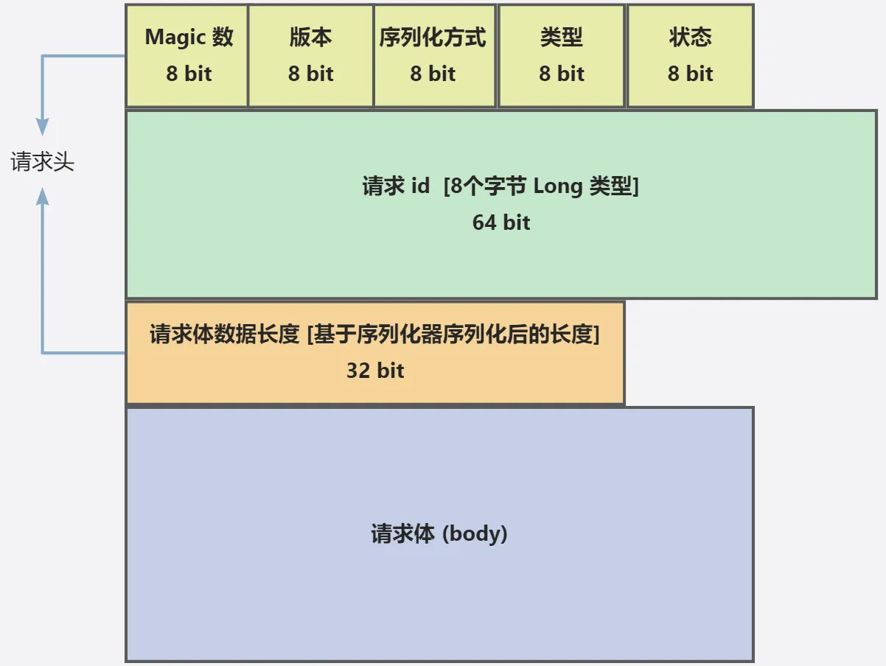

# Chapter 7. 自定义协议

## 一、需求分析

目前的 RPC 框架，我们使用 Vert.x 的 HttpServer 作为服务提供者的服务器，代码实现比较简单，其底层网络传输使用的是 HTTP 协议。

很多同学会把 HTTP 和 RPC 理解为同一类技术，但 HTTP 只是 RPC 框架网络传输的一种可选方式罢了。

问题来了，使用 HTTP 协议会有什么问题么？或者说，有没有更好的选择？

一般情况下，RPC 框架会比较注重性能，而 HTTP 协议中的头部信息、请求响应格式较"重"，会影响网络传输性能。

举个例子，利用浏览器网络控制台随便查看一个请求，能看到大量的请求和响应标头

所以，我们需要自己自定义一套 RPC 协议，比如利用 TCP 等传输层协议、自己定义请求响应结构，来实现性能更高、更灵活、更安全的 RPC 框架。

本节教程，鱼皮会带大家自定义 RPC 协议，巩固计算机网络知识，并提升自己的系统设计能力。

## 二、设计方案

自定义 RPC 协议可以分为 2 大核心部分：

- 自定义网络传输
- 自定义消息结构

### 1、网络传输设计

网络传输设计的目标是：选择一个能够高性能通信的网络协议和传输方式。

需求分析中已经提到了，HTTP 协议的头信息是比较大的，会影响传输性能。但其实除了这点外，HTTP 本身属于无状态协议，这意味着每个 HTTP 请求都是独立的，每次请求 / 响应都要重新建立和关闭连接，也会影响性能。

考虑到这点，在 HTTP/1.1 中引入了持久连接（Keep-Alive），允许在单个 TCP 连接上发送多个 HTTP 请求和响应，避免了每次请求都要重新建立和关闭连接的开销。

虽然如此，HTTP 本身是应用层协议，我们现在设计的 RPC 协议也是应用层协议，性能肯定是不如底层（传输层）的 TCP 协议要高的。所以我们想要追求更高的性能，还是选择使用 TCP 协议完成网络传输，有更多的自主设计空间。

### 2、消息结构设计

消息结构设计的目标是：用 **最少的** 空间传递 **需要的** 信息。

1）如何使用最少的空间呢？

大家之前接触到的数据类型可能都是整型、长整型、浮点数类型等等，这些类型其实都比较"重"，占用的字节数较多。比如整型要占用 4 个字节、32 个 bit 位。

我们在自定义消息结构时，想要节省空间，就要尽可能使用更轻量的类型，比如 byte 字节类型，只占用 1 个字节、8 个 bit 位。

需要注意的是，Java 中实现 bit 位运算拼接相对比较麻烦，所以权衡开发成本，我们设计消息结构时，尽量给每个数据凑到整个字节。

2）消息内需要哪些信息呢？

目标肯定是能够完成请求嘛，那我们何不从之前的 HTTP 请求方式中，找到一些线索？

分析 HTTP 请求结构，我们能够得到 RPC 消息所需的信息：

- **魔数**：作用是安全校验，防止服务器处理了非框架发来的乱七八糟的消息（类似 HTTPS 的安全证书）
- **版本号**：保证请求和响应的一致性（类似 HTTP 协议有 1.0/2.0 等版本）
- **序列化方式**：来告诉服务端和客户端如何解析数据（类似 HTTP 的 Content-Type 内容类型）
- **类型**：标识是请求还是响应？或者是心跳检测等其他用途。（类似 HTTP 有请求头和响应头）
- **状态**：如果是响应，记录响应的结果（类似 HTTP 的 200 状态代码）

此外，还需要有请求 id，唯一标识某个请求，因为 TCP 是双向通信的，需要有个唯一标识来追踪每个请求。

最后，也是最重要的，要发送 body 内容数据。我们暂时称它为 **请求体**，类似于我们之前 HTTP 请求中发送的 RpcRequest。

如果是 HTTP 这种协议，有专门的 key / value 结构，很容易找到完整的 body 数据。但基于 TCP 协议，想要获取到完整的 body 内容数据，就需要一些"小心思"了，因为 TCP 协议本身会存在半包和粘包问题，每次传输的数据可能是不完整的，具体的后面会讲。

所以我们需要在消息头中新增一个字段 **请求体数据长度**，保证能够完整地获取 body 内容信息。

基于以上的思考，我们可以得到最终的消息结构设计，如下图：



实际上，这些数据应该是紧凑的，请求头信息总长 17 个字节。也就是说，上述消息结构，本质上就是拼接在一起的一个字节数组。我们后续实现时，需要有 **消息编码器** 和 **消息解码器**，编码器先 new 一个空的 Buffer 缓冲区，然后按照顺序向缓冲区依次写入这些数据；解码器在读取时也按照顺序依次读取，就能还原出编码前的数据。

通过这种约定的方式，我们就不用记录头信息了。比如 magic 魔数，不用存储"magic"这个字符串，而是读取第一个字节（前 8 bit）就能获取到。

如果你学过 Redis 底层，会发现很多数据结构都是这种设计。

如果大家是第一次设计协议，或者经验不足，强烈建议大家先去学一下优秀开源框架的协议设计，这样不会说毫无头绪。

比如鱼皮就参考了 Dubbo 的协议设计，如下图(并没有图)

明确了设计后，我们来开发实现，就比较简单了。

## 三、开发实现

### 1、消息结构

新建 `protocol` 包，将所有和自定义协议有关的代码都放到该包下。

1）新建协议消息类 `ProtocolMessage`。

将消息头单独封装为一个内部类，消息体可以使用泛型类型，完整代码如下：

```java
package com.rom.romrpc.protocol;

import lombok.AllArgsConstructor;
import lombok.Data;
import lombok.NoArgsConstructor;

/**
 * 协议消息结构
 *
 */
@Data
@AllArgsConstructor
@NoArgsConstructor
public class ProtocolMessage<T> {

    /**
     * 消息头
     */
    private Header header;

    /**
     * 消息体（请求或响应对象）
     */
    private T body;

    /**
     * 协议消息头
     */
    @Data
    public static class Header {

        /**
         * 魔数，保证安全性
         */
        private byte magic;

        /**
         * 版本号
         */
        private byte version;

        /**
         * 序列化器
         */
        private byte serializer;

        /**
         * 消息类型（请求 / 响应）
         */
        private byte type;

        /**
         * 状态
         */
        private byte status;

        /**
         * 请求 id
         */
        private long requestId;

        /**
         * 消息体长度
         */
        private int bodyLength;
    }

}
```

2）新建协议常量类 ProtocolConstant。

记录了和自定义协议有关的关键信息，比如消息头长度、魔数、版本号。

完整代码如下：

```java
package com.rom.romrpc.protocol;

/**
 * 协议常量
 *
 */
public interface ProtocolConstant {

    /**
     * 消息头长度
     */
    int MESSAGE_HEADER_LENGTH = 17;

    /**
     * 协议魔数
     */
    byte PROTOCOL_MAGIC = 0x1;

    /**
     * 协议版本号
     */
    byte PROTOCOL_VERSION = 0x1;
}
```

3）新建消息字段的枚举类，比如：

协议状态枚举，暂时只定义成功、请求失败、响应失败三种枚举值：

```java
package com.rom.romrpc.protocol;

import lombok.Getter;

/**
 * 协议消息的状态枚举
 *
 */
@Getter
public enum ProtocolMessageStatusEnum {

    OK("ok", 20),
    BAD_REQUEST("badRequest", 40),
    BAD_RESPONSE("badResponse", 50);

    private final String text;

    private final int value;

    ProtocolMessageStatusEnum(String text, int value) {
        this.text = text;
        this.value = value;
    }

    /**
     * 根据 value 获取枚举
     *
     * @param value
     * @return
     */
    public static ProtocolMessageStatusEnum getEnumByValue(int value) {
        for (ProtocolMessageStatusEnum anEnum : ProtocolMessageStatusEnum.values()) {
            if (anEnum.value == value) {
                return anEnum;
            }
        }
        return null;
    }
}
```

协议消息类型枚举，包括请求、响应、心跳、其他。代码如下：

```java
package com.rom.romrpc.protocol;

import lombok.Getter;

/**
 * 协议消息的类型枚举
 *
 */
@Getter
public enum ProtocolMessageTypeEnum {

    REQUEST(0),
    RESPONSE(1),
    HEART_BEAT(2),
    OTHERS(3);

    private final int key;

    ProtocolMessageTypeEnum(int key) {
        this.key = key;
    }

    /**
     * 根据 key 获取枚举
     *
     * @param key
     * @return
     */
    public static ProtocolMessageTypeEnum getEnumByKey(int key) {
        for (ProtocolMessageTypeEnum anEnum : ProtocolMessageTypeEnum.values()) {
            if (anEnum.key == key) {
                return anEnum;
            }
        }
        return null;
    }
}
```

协议消息的序列化器枚举，跟我们 RPC 框架已支持的序列化器对应。代码如下：

```java
package com.rom.romrpc.protocol;

import java.util.Arrays;
import java.util.List;
import java.util.stream.Collectors;

import cn.hutool.core.util.ObjectUtil;
import lombok.Getter;

/**
 * 协议消息的序列化器枚举
 *
 */
@Getter
public enum ProtocolMessageSerializerEnum {

    JDK(0, "jdk"),
    JSON(1, "json"),
    KRYO(2, "kryo"),
    HESSIAN(3, "hessian");

    private final int key;

    private final String value;

    ProtocolMessageSerializerEnum(int key, String value) {
        this.key = key;
        this.value = value;
    }

    /**
     * 获取值列表
     *
     * @return
     */
    public static List<String> getValues() {
        return Arrays.stream(values()).map(item -> item.value).collect(Collectors.toList());
    }

    /**
     * 根据 key 获取枚举
     *
     * @param key
     * @return
     */
    public static ProtocolMessageSerializerEnum getEnumByKey(int key) {
        for (ProtocolMessageSerializerEnum anEnum : ProtocolMessageSerializerEnum.values()) {
            if (anEnum.key == key) {
                return anEnum;
            }
        }
        return null;
    }


    /**
     * 根据 value 获取枚举
     *
     * @param value
     * @return
     */
    public static ProtocolMessageSerializerEnum getEnumByValue(String value) {
        if (ObjectUtil.isEmpty(value)) {
            return null;
        }
        for (ProtocolMessageSerializerEnum anEnum : ProtocolMessageSerializerEnum.values()) {
            if (anEnum.value.equals(value)) {
                return anEnum;
            }
        }
        return null;
    }
}
```

### 2、网络传输

我们的 RPC 框架使用了高性能的 Vert.x 作为网络传输服务器，之前用的是 HttpServer。同样，Vert.x 也支持 TCP 服务器，相比于 Netty 或者自己写 Socket 代码，更加简单易用

首先新建 server.tcp 包，将所有 TCP 服务相关的代码放到该包中。

1）TCP 服务器实现。

新建 VertxTcpServer 类，跟之前写的 VertxHttpServer 类似，先创建 Vert.x 的服务器实例，然后定义处理请求的方法，比如回复"Hello, client!"，最后启动服务器。

示例代码如下：

```java
package com.rom.romrpc.server.tcp;

import com.rom.romrpc.server.HttpServer;

import io.vertx.core.Vertx;
import io.vertx.core.buffer.Buffer;
import io.vertx.core.net.NetServer;

public class VertxTcpServer implements HttpServer {

    private byte[] handleRequest(byte[] requestData) {
        // 在这里编写处理请求的逻辑，根据 requestData 构造响应数据并返回
        // 这里只是一个示例，实际逻辑需要根据具体的业务需求来实现
        return "Hello, client!".getBytes();
    }

    @Override
    public void doStart(int port) {
        // 创建 Vert.x 实例
        Vertx vertx = Vertx.vertx();

        // 创建 TCP 服务器
        NetServer server = vertx.createNetServer();

        // 处理请求
        server.connectHandler(socket -> {
            // 处理连接
            socket.handler(buffer -> {
                // 处理接收到的字节数组
                byte[] requestData = buffer.getBytes();
                // 在这里进行自定义的字节数组处理逻辑，比如解析请求、调用服务、构造响应等
                byte[] responseData = handleRequest(requestData);
                // 发送响应
                socket.write(Buffer.buffer(responseData));
            });
        });

        // 启动 TCP 服务器并监听指定端口
        server.listen(port, result -> {
            if (result.succeeded()) {
                System.out.println("TCP server started on port " + port);
            } else {
                System.err.println("Failed to start TCP server: " + result.cause());
            }
        });
    }

    public static void main(String[] args) {
        new VertxTcpServer().doStart(8888);
    }
}

```

上述代码中的 `socket.write` 方法，就是在向连接到服务器的客户端发送数据。注意发送的数据格式为 Buffer，这是 Vert.x 为我们提供的字节数组缓冲区实现。

2）TCP 客户端实现。

新建 VertxTcpClient 类，先创建 Vert.x 的客户端实例，然后定义处理请求的方法，比如回复"Hello, server!"，并建立连接。

示例代码如下：

```java
package com.rom.romrpc.server.tcp;

import io.vertx.core.Vertx;

public class VertxTcpClient {
    
    public void start() {
        // 创建 Vert.x 实例
        Vertx vertx = Vertx.vertx();

        vertx.createNetClient().connect(8888, "localhost", result -> {
            if (result.succeeded()) {
                System.out.println("Connected to TCP server");
                io.vertx.core.net.NetSocket socket = result.result();
                // 发送数据
                socket.write("Hello, server!");
                // 接收响应
                socket.handler(buffer -> {
                    System.out.println("Received response from server: " + buffer.toString());
                });
            } else {
                System.err.println("Failed to connect to TCP server");
            }
        });
    }

    public static void main(String[] args) {
        new VertxTcpClient().start();
    }
}
```

3）可以先进行简单的测试，先启动服务器，再启动客户端，能够在控制台看到它们互相打招呼的输出。

### 3、编码 / 解码器

在上一步中，我们也注意到了，Vert.x 的 TCP 服务器收发的消息是 Buffer 类型，不能直接写入一个对象。因此，我们需要编码器和解码器，将 Java 的消息对象和 Buffer 进行相互转换。

鱼皮只用一张图，通过演示整个请求和响应的过程，相信就能带大家了解编码器和解码器的作用。


之前 HTTP 请求和响应时，直接从请求 body 处理器中获取到 body 字节数组，再通过序列化（反序列化）得到 RpcRequest 或 RpcResponse 对象。使用 TCP 服务器后，只不过改为从 Buffer 中获取字节数组，然后编解码为 RpcRequest 或 RpcResponse 对象。其他的后续处理流程都是可复用的。

1）首先实现消息编码器。

在 protocol 包下新建 `ProtocolMessageEncoder`，核心流程是依次向 Buffer 缓冲区写入消息对象里的字段。

代码如下：

```java
package com.rom.romrpc.protocol;

import java.io.IOException;

import com.rom.romrpc.serializer.Serializer;
import com.rom.romrpc.serializer.SerializerFactory;

import io.vertx.core.buffer.Buffer;

public class ProtocolMessageEncoder {
    
     /**
     * 编码
     *
     * @param protocolMessage
     * @return
     * @throws IOException
     */
    public static Buffer encode(ProtocolMessage<?> protocolMessage) throws IOException {
        if (protocolMessage == null || protocolMessage.getHeader() == null) {
            return Buffer.buffer();
        }
        ProtocolMessage.Header header = protocolMessage.getHeader();
        // 依次向缓冲区写入字节
        Buffer buffer = Buffer.buffer();
        buffer.appendByte(header.getMagic());
        buffer.appendByte(header.getVersion());
        buffer.appendByte(header.getSerializer());
        buffer.appendByte(header.getType());
        buffer.appendByte(header.getStatus());
        buffer.appendLong(header.getRequestId());
        // 获取序列化器
        ProtocolMessageSerializerEnum serializerEnum = ProtocolMessageSerializerEnum.getEnumByKey(header.getSerializer());
        if (serializerEnum == null) {
            throw new RuntimeException("序列化协议不存在");
        }
        Serializer serializer = SerializerFactory.getInstance(serializerEnum.getValue());
        byte[] bodyBytes = serializer.serialize(protocolMessage.getBody());
        // 写入 body 长度和数据
        buffer.appendInt(bodyBytes.length);
        buffer.appendBytes(bodyBytes);
        return buffer;
    }
}
```

2）实现消息解码器。

在 protocol 包下新建 ProtocolMessageDecoder，核心流程是依次从 Buffer 缓冲区的指定位置读取字段，构造出完整的消息对象。

代码如下：

```java
package com.rom.romrpc.protocol;

import java.io.IOException;

import com.rom.romrpc.model.RpcRequest;
import com.rom.romrpc.model.RpcResponse;
import com.rom.romrpc.serializer.Serializer;
import com.rom.romrpc.serializer.SerializerFactory;

import io.vertx.core.buffer.Buffer;

/**
 * 协议消息解码器
 */
public class ProtocolMessageDecoder {

    /**
     * 解码
     *
     * @param buffer
     * @return
     * @throws IOException
     */

    public static ProtocolMessage<?> decode(Buffer buffer) throws IOException {
        // 分别从指定位置读出 Buffer
        ProtocolMessage.Header header = new ProtocolMessage.Header();
        byte magic = buffer.getByte(0);
        // 校验魔数
        if (magic != ProtocolConstant.PROTOCOL_MAGIC) {
            throw new RuntimeException("消息 magic 非法");
        }
        header.setMagic(magic);
        header.setVersion(buffer.getByte(1));
        header.setSerializer(buffer.getByte(2));
        header.setType(buffer.getByte(3));
        header.setStatus(buffer.getByte(4));
        header.setRequestId(buffer.getLong(5));
        header.setBodyLength(buffer.getInt(13));
        // 解决粘包问题，只读指定长度的数据
        byte[] bodyBytes = buffer.getBytes(17, 17 + header.getBodyLength());
        // 解析消息体
        ProtocolMessageSerializerEnum serializerEnum = ProtocolMessageSerializerEnum.getEnumByKey(header.getSerializer());
        if (serializerEnum == null) {
            throw new RuntimeException("序列化消息的协议不存在");
        }
        Serializer serializer = SerializerFactory.getInstance(serializerEnum.getValue());
        ProtocolMessageTypeEnum messageTypeEnum = ProtocolMessageTypeEnum.getEnumByKey(header.getType());
        if (messageTypeEnum == null) {
            throw new RuntimeException("序列化消息的类型不存在");
        }
        switch (messageTypeEnum) {
            case REQUEST:
                RpcRequest request = serializer.deserialize(bodyBytes, RpcRequest.class);
                return new ProtocolMessage<>(header, request);
            case RESPONSE:
                RpcResponse response = serializer.deserialize(bodyBytes, RpcResponse.class);
                return new ProtocolMessage<>(header, response);
            case HEART_BEAT:
            case OTHERS:
            default:
                throw new RuntimeException("暂不支持该消息类型");
        }
    }
}
```

3）编写单元测试类，先编码再解码，以测试编码器和解码器的正确性。

代码如下：

```java
package com.rom.romrpc.protocol;

import java.io.IOException;

import org.junit.jupiter.api.Assertions;
import org.junit.jupiter.api.Test;

import com.rom.romrpc.constant.RpcConstant;
import com.rom.romrpc.model.RpcRequest;

import cn.hutool.core.util.IdUtil;
import io.vertx.core.buffer.Buffer;

public class ProtocolMessageTest {
    @Test
    public void testEncodeAndDecode() throws IOException {
        // 构造消息
        ProtocolMessage<RpcRequest> protocolMessage = new ProtocolMessage<>();
        ProtocolMessage.Header header = new ProtocolMessage.Header();
        header.setMagic(ProtocolConstant.PROTOCOL_MAGIC);
        header.setVersion(ProtocolConstant.PROTOCOL_VERSION);
        header.setSerializer((byte) ProtocolMessageSerializerEnum.JDK.getKey());
        header.setType((byte) ProtocolMessageTypeEnum.REQUEST.getKey());
        header.setStatus((byte) ProtocolMessageStatusEnum.OK.getValue());
        header.setRequestId(IdUtil.getSnowflakeNextId());
        header.setBodyLength(0);
        RpcRequest rpcRequest = new RpcRequest();
        rpcRequest.setServiceName("myService");
        rpcRequest.setMethodName("myMethod");
        rpcRequest.setServiceVersion(RpcConstant.DEFAULT_SERVICE_VERSION);
        rpcRequest.setParameterTypes(new Class[]{String.class});
        rpcRequest.setArgs(new Object[]{"aaa", "bbb"});
        protocolMessage.setHeader(header);
        protocolMessage.setBody(rpcRequest);

        Buffer encodeBuffer = ProtocolMessageEncoder.encode(protocolMessage);
        ProtocolMessage<?> message = ProtocolMessageDecoder.decode(encodeBuffer);
        Assertions.assertNotNull(message);
    }
}
```

### 4、请求处理器（服务提供者）

可以使用 netty 的 pipeline 组合多个 handler（比如编码 => 解码 => 请求 / 响应处理）

请求处理器的作用是接受请求，然后通过反射调用服务实现类。

类似之前的 HttpServerHandler，我们需要开发一个 TcpServerHandler，用于处理请求。和 HttpServerHandler 的区别只是在获取请求、写入响应的方式上，需要调用上面开发好的编码器和解码器。

通过实现 Vert.x 提供的 Handler<NetSocket> 接口，可以定义 TCP 请求处理器。

完整代码如下，大多数代码都是从之前写好的 HttpServerHandler 复制来的：

```java
package com.rom.romrpc.server.tcp;

import java.io.IOException;
import java.lang.reflect.Method;

import com.rom.romrpc.model.RpcRequest;
import com.rom.romrpc.model.RpcResponse;
import com.rom.romrpc.protocol.ProtocolMessage;
import com.rom.romrpc.protocol.ProtocolMessageDecoder;
import com.rom.romrpc.protocol.ProtocolMessageEncoder;
import com.rom.romrpc.protocol.ProtocolMessageTypeEnum;
import com.rom.romrpc.registry.LocalRegistry;

import io.vertx.core.Handler;
import io.vertx.core.buffer.Buffer;
import io.vertx.core.net.NetSocket;

public class TcpServerHandler implements Handler<NetSocket> {

    @Override
    public void handle(NetSocket netSocket) {
        // 处理连接
        netSocket.handler(buffer -> {
            // 接受请求，解码
            ProtocolMessage<RpcRequest> protocolMessage;
            try {
                protocolMessage = (ProtocolMessage<RpcRequest>) ProtocolMessageDecoder.decode(buffer);
            } catch (IOException e) {
                throw new RuntimeException("协议消息解码错误");
            }
            RpcRequest rpcRequest = protocolMessage.getBody();

            // 处理请求
            // 构造响应结果对象
            RpcResponse rpcResponse = new RpcResponse();
            try {
                // 获取要调用的服务实现类，通过反射调用
                Class<?> implClass = LocalRegistry.get(rpcRequest.getServiceName());
                Method method = implClass.getMethod(rpcRequest.getMethodName(), rpcRequest.getParameterTypes());
                Object result = method.invoke(implClass.getDeclaredConstructor().newInstance(), rpcRequest.getArgs());
                // 封装返回结果
                rpcResponse.setData(result);
                rpcResponse.setDataType(method.getReturnType());
                rpcResponse.setMessage("ok");
            } catch (Exception e) {
                e.printStackTrace();
                rpcResponse.setMessage(e.getMessage());
                rpcResponse.setException(e);
            }

            // 发送响应，编码
            ProtocolMessage.Header header = protocolMessage.getHeader();
            header.setType((byte) ProtocolMessageTypeEnum.RESPONSE.getKey());
            ProtocolMessage<RpcResponse> responseProtocolMessage = new ProtocolMessage<>(header, rpcResponse);
            try {
                Buffer encode = ProtocolMessageEncoder.encode(responseProtocolMessage);
                netSocket.write(encode);
            } catch (IOException e) {
                throw new RuntimeException("协议消息编码错误");
            }
        });
    }
}
```

### 5、请求发送（服务消费者）

调整服务消费者发送请求的代码，改 HTTP 请求为 TCP 请求。

代码如下：

```java
public class ServiceProxy implements InvocationHandler {

    /**
     * 调用代理
     *
     * @return
     * @throws Throwable
     */
    @Override
    public Object invoke(Object proxy, Method method, Object[] args) throws Throwable {
        // 指定序列化器
        final Serializer serializer = SerializerFactory.getInstance(RpcApplication.getRpcConfig().getSerializer());

        // 构造请求
        String serviceName = method.getDeclaringClass().getName();
        RpcRequest rpcRequest = RpcRequest.builder()
                .serviceName(serviceName)
                .methodName(method.getName())
                .parameterTypes(method.getParameterTypes())
                .args(args)
                .build();
        try {
            // 序列化
            byte[] bodyBytes = serializer.serialize(rpcRequest);
            // 从注册中心获取服务提供者请求地址
            RpcConfig rpcConfig = RpcApplication.getRpcConfig();
            Registry registry = RegistryFactory.getInstance(rpcConfig.getRegistryConfig().getRegistry());
            ServiceMetaInfo serviceMetaInfo = new ServiceMetaInfo();
            serviceMetaInfo.setServiceName(serviceName);
            serviceMetaInfo.setServiceVersion(RpcConstant.DEFAULT_SERVICE_VERSION);
           List<ServiceMetaInfo> serviceMetaInfoList = registry.serviceDiscovery(serviceMetaInfo.getServiceKey());
           if (CollUtil.isEmpty(serviceMetaInfoList)) {
               throw new RuntimeException("暂无服务地址");
           }
           ServiceMetaInfo selectedServiceMetaInfo = serviceMetaInfoList.get(0);
            // 发送 TCP 请求
            Vertx vertx = Vertx.vertx();
            NetClient netClient = vertx.createNetClient();
            CompletableFuture<RpcResponse> responseFuture = new CompletableFuture<>();
            netClient.connect(selectedServiceMetaInfo.getServicePort(), selectedServiceMetaInfo.getServiceHost(),
                    result -> {
                        if (result.succeeded()) {
                            System.out.println("Connected to TCP server");
                            io.vertx.core.net.NetSocket socket = result.result();
                            // 发送数据
                            // 构造消息
                            ProtocolMessage<RpcRequest> protocolMessage = new ProtocolMessage<>();
                            ProtocolMessage.Header header = new ProtocolMessage.Header();
                            header.setMagic(ProtocolConstant.PROTOCOL_MAGIC);
                            header.setVersion(ProtocolConstant.PROTOCOL_VERSION);
                            header.setSerializer((byte) ProtocolMessageSerializerEnum.getEnumByValue(RpcApplication.getRpcConfig().getSerializer()).getKey());
                            header.setType((byte) ProtocolMessageTypeEnum.REQUEST.getKey());
                            header.setRequestId(IdUtil.getSnowflakeNextId());
                            protocolMessage.setHeader(header);
                            protocolMessage.setBody(rpcRequest);
                            // 编码请求
                            try {
                                Buffer encodeBuffer = ProtocolMessageEncoder.encode(protocolMessage);
                                socket.write(encodeBuffer);
                            } catch (IOException e) {
                                throw new RuntimeException("协议消息编码错误");
                            }

                            // 接收响应
                            socket.handler(buffer -> {
                                try {
                                    ProtocolMessage<RpcResponse> rpcResponseProtocolMessage = (ProtocolMessage<RpcResponse>) ProtocolMessageDecoder.decode(buffer);
                                    responseFuture.complete(rpcResponseProtocolMessage.getBody());
                                } catch (IOException e) {
                                    throw new RuntimeException("协议消息解码错误");
                                }
                            });
                        } else {
                            System.err.println("Failed to connect to TCP server");
                        }
                    });

            RpcResponse rpcResponse = responseFuture.get();
            // 记得关闭连接
            netClient.close();
            return rpcResponse.getData();
        } catch (IOException e) {
            e.printStackTrace();
        }

        return null;
    }
}
```

这里的代码看着比较复杂，但只需要关注上述代码中注释了"发送 TCP 请求"的部分即可。由于 Vert.x 提供的请求处理器是异步、反应式的，我们为了更方便地获取结果，可以使用 CompletableFuture 转异步为同步，参考代码如下：

```java
CompletableFuture<RpcResponse> responseFuture = new CompletableFuture<>();
netClient.connect(xxx,
    result -> {
        // 完成了响应
        responseFuture.complete(rpcResponseProtocolMessage.getBody());
    });

// 阻塞，直到响应完成，才会继续向下执行
RpcResponse rpcResponse = responseFuture.get();
```

等下也会带大家优化上述代码。

## 四、测试

编写好上述代码后，我们就可以先测试请求响应流程是否跑通了。

修改服务提供者 ProviderExample 代码，改为启动 TCP 服务器。完整代码如下：

```java
/**
 * 提供者示例
 * @author 
 */
public class ProviderExample {
    public static void main(String[] args) {
        
        ...

        // 启动 web 服务
        // HttpServer httpServer = new VertxHttpServer();
        // httpServer.doStart(RpcApplication.getRpcConfig().getServerPort());

        // 启动 TCP 服务
        VertxTcpServer vertxTcpServer = new VertxTcpServer();
        vertxTcpServer.doStart(8080);
    }
}
```

然后启动消费者示例项目，应该能够正常完成调用。如果不能，那可能就是出现了我们接下来要讲的问题 —— 粘包半包问题

## 五、粘包半包问题解决

### 什么是粘包和半包？

使用 TCP 协议网络通讯时，可能会出现半包和粘包问题。

我举个例子大家就明白了。

理想情况下，假如我们客户端 **连续 2 次** 要发送的消息是：

```java
// 第一次
Hello, server!Hello, server!Hello, server!Hello, server!
// 第二次
Hello, server!Hello, server!Hello, server!Hello, server!
```

但服务端收到的消息情况可能是：

1）每次收到的数据更少了，这种情况叫做 **半包**：

```java
// 第一次
Hello, server!Hello, server!
// 第二次
Hello, server!Hello, server!Hello, server!
```

2）每次收到的数据更多了，这种情况叫做 **粘包**：

```java
// 第一次
Hello, server!Hello, server!Hello, server!Hello, server!Hello, server!Hello, server!
```

### 半包粘包问题演示

为了更好地理解半包和粘包，我们可以编写代码来测试。

1）修改 TCP 客户端代码，连续发送 1000 次消息：

```java
package com.rom.romrpc.server.tcp;

import io.vertx.core.Vertx;

public class VertxTcpClient {

    public void start() {
       ···
        for (int i = 0; i < 1000; i++) {
            // 发送数据
            socket.write("Hello, server!Hello, server!Hello, server!Hello, server!");
        }
        ···
    }

    public static void main(String[] args) {
        new VertxTcpClient().start();
    }
}
```

2）修改 TCP 服务端代码，打印出每次收到的消息：

```java
public class VertxTcpServer implements HttpServer {

    // private byte[] handleRequest(byte[] requestData) {
    //     // 在这里编写处理请求的逻辑，根据 requestData 构造响应数据并返回
    //     // 这里只是一个示例，实际逻辑需要根据具体的业务需求来实现
    //     return "Hello, client!".getBytes();
    // }

    @Override
    public void doStart(int port) {
        // 创建 Vert.x 实例
        Vertx vertx = Vertx.vertx();

        // 创建 TCP 服务器
        NetServer server = vertx.createNetServer();

        // 处理请求
//        server.connectHandler(new TcpServerHandler());
        server.connectHandler(socket -> {
            socket.handler(buffer -> {
                String testMessage = "Hello, server!Hello, server!Hello, server!Hello, server!";
                int messageLength = testMessage.getBytes().length;
                if (buffer.getBytes().length < messageLength) {
                    System.out.println("半包, length = " + buffer.getBytes().length);
                    return;
                }
                if (buffer.getBytes().length > messageLength) {
                    System.out.println("粘包, length = " + buffer.getBytes().length);
                    return;
                }
                String str = new String(buffer.getBytes(0, messageLength));
                System.out.println(str);
                if (testMessage.equals(str)) {
                    System.out.println("good");
                }
            });
        });

        // 启动 TCP 服务器并监听指定端口
        server.listen(port, result -> {
            if (result.succeeded()) {
                System.out.println("TCP server started on port " + port);
            } else {
                System.out.println("Failed to start TCP server: " + result.cause());
            }
        });
    }


    public static void main(String[] args) {
        new VertxTcpServer().doStart(8888);
    }
}
```

3）测试运行，查看服务端控制台，发现服务端接受消息时，出现了半包和粘包：

下面我们分别解决半包和粘包问题。

### 如何解决半包？

解决半包的核心思路是：在消息头中设置请求体的长度，服务端接收时，判断每次消息的长度是否符合预期，不完整就不读，留到下一次接收到消息时再读取。

示例代码如下：

```java
if (buffer == null || buffer.length() == 0) {
    throw new RuntimeException("消息 buffer 为空");
}
if (buffer.getBytes().length < ProtocolConstant.MESSAGE_HEADER_LENGTH) {
    throw new RuntimeException("出现了半包问题");
}
```

### 如何解决粘包？

解决粘包的核心思路也是类似的：每次只读取指定长度的数据，超过长度的留着下一次接收到消息时再读取。

示例代码如下：

```java
// 解决粘包问题，只读指定长度的数据
byte[] bodyBytes = buffer.getBytes(17, 17 + header.getBodyLength());
```

听上去简单，但自己实现起来还是比较麻烦的，要记录每次接收到的消息位置，维护字节数组缓存。有没有更简单的方式呢？

### Vert.x 解决半包和粘包

在 Vert.x 框架中，可以使用内置的 RecordParser 完美解决半包粘包，它的作用是：保证下次读取到 **特定长度** 的字符。

先不要急着直接修改业务代码，而是先学会该类库的使用，跑通测试流程，再引入到自己的业务代码中。

#### 基础代码

1）先小试牛刀，使用 RecordParser 来读取固定长度的消息，示例代码如下：

```java
```

上述代码的核心是 RecordParser.newFixed(messageLength)，为 Parser 指定每次读取固定值长度的内容。

测试发现，这次的输出结果非常整齐，解决了半包和粘包：

2）实际运用中，消息体的长度是不固定的，所以要通过调整 RecordParser 的固定长度（变长）来解决。

那我们的思路可以是，将读取完整的消息拆分为 2 次：

1. 先完整读取请求头信息，由于请求头信息长度是固定的，可以使用 RecordParser 保证每次都完整读取。
2. 再根据请求头长度信息更改 RecordParser 的固定长度，保证完整获取到请求体。

修改测试 TCP Server 代码如下：

```java
public class VertxTcpServer implements HttpServer {

    @Override
    public void doStart(int port) {
        // 创建 Vert.x 实例
        Vertx vertx = Vertx.vertx();

        // 创建 TCP 服务器
        NetServer server = vertx.createNetServer();

        // 处理请求
//        server.connectHandler(new TcpServerHandler());
        server.connectHandler(socket -> {
            String testMessage = "Hello, server!Hello, server!Hello, server!Hello, server!";
            int messageLength = testMessage.getBytes().length;

            // 构造parser
            RecordParser parser = RecordParser.newFixed(messageLength);
            parser.setOutput(new Handler<Buffer>() {

                @Override
                public void handle(Buffer buffer) {
                    String str = new String(buffer.getBytes());
                    System.out.println(str);
                    if (testMessage.equals(str)) {
                        System.out.println("good");
                    }
                }
            });

            socket.handler(parser);
        });

        // 启动 TCP 服务器并监听指定端口
        server.listen(port, result -> {
            if (result.succeeded()) {
                log.info("TCP server started on port " + port);
            } else {
                log.info("Failed to start TCP server: " + result.cause());
            }
        });
    }

    public static void main(String[] args) {
        new VertxTcpServer().doStart(8888);
    }
}
```

修改测试 TCP client 代码如下，自己构造了一个变长、长度信息不在 Buffer 最开头（而是有一定偏移量）的消息：

```java
import io.vertx.core.Vertx;
import io.vertx.core.buffer.Buffer;

public class VertxTcpClient {

    public void start() {
        // 创建 Vert.x 实例
        Vertx vertx = Vertx.vertx();

        vertx.createNetClient().connect(8888, "localhost", result -> {
            if (result.succeeded()) {
                System.out.println("Connected to TCP server");
                io.vertx.core.net.NetSocket socket = result.result();
                for (int i = 0; i < 1000; i++) {
                    // 发送数据
                    Buffer buffer = Buffer.buffer();
                    String str = "Hello, server!Hello, server!Hello, server!Hello, server!";
                    buffer.appendInt(0);
                    buffer.appendInt(str.getBytes().length);
                    buffer.appendBytes(str.getBytes());
                    socket.write(buffer);
                }
                // 接收响应
                socket.handler(buffer -> {
                    System.out.println("Received response from server: " + buffer.toString());
                });
            } else {
                System.err.println("Failed to connect to TCP server");
            }
        });
    }

    public static void main(String[] args) {
        new VertxTcpClient().start();
    }
}
```

测试结果应该也是能够正常读取到消息的，不会出现半包和粘包。

#### 封装半包粘包处理器

我们也会发现，解决半包粘包问题还是有一定的代码量的，而且由于 ServiceProxy（消费者）和请求 Handler（提供者）都需要接受 Buffer，所以都需要半包粘包问题处理。

那我们就应该要想到：需要对代码进行封装复用了。

这里我们可以使用设计模式中的 **装饰者模式**，使用 RecordParser 对原有的 Buffer 处理器的能力进行增强。

装饰者模式可以简单理解为给对象穿装备，增强对象的能力。

在 server.tcp 包下新建 TcpBufferHandlerWrapper 类，实现并增强 Handler<Buffer> 接口。

完整代码如下：

```java
package com.rom.romrpc.server.tcp;

import com.rom.romrpc.protocol.ProtocolConstant;

import io.vertx.core.Handler;
import io.vertx.core.buffer.Buffer;
import io.vertx.core.parsetools.RecordParser;

/**
 * 装饰者模式（使用 recordParser 对原有的 buffer 处理能力进行增强）
 */
public class TcpBufferHandlerWrapper implements Handler<Buffer> {

    private final RecordParser recordParser;

    public TcpBufferHandlerWrapper(Handler<Buffer> bufferHandler) {
        recordParser = initRecordParser(bufferHandler);
    }

    @Override
    public void handle(Buffer buffer) {
        recordParser.handle(buffer);
    }

    private RecordParser initRecordParser(Handler<Buffer> bufferHandler) {
        // 构造 parser
        RecordParser parser = RecordParser.newFixed(ProtocolConstant.MESSAGE_HEADER_LENGTH);

        parser.setOutput(new Handler<Buffer>() {
            // 初始化
            int size = -1;
            // 一次完整的读取（头 + 体）
            Buffer resultBuffer = Buffer.buffer();

            @Override
            public void handle(Buffer buffer) {
                if (-1 == size) {
                    // 读取消息体长度
                    size = buffer.getInt(13);
                    parser.fixedSizeMode(size);
                    // 写入头信息到结果
                    resultBuffer.appendBuffer(buffer);
                } else {
                    // 写入体信息到结果
                    resultBuffer.appendBuffer(buffer);
                    // 已拼接为完整 Buffer，执行处理
                    bufferHandler.handle(resultBuffer);
                    // 重置一轮
                    parser.fixedSizeMode(ProtocolConstant.MESSAGE_HEADER_LENGTH);
                    size = -1;
                    resultBuffer = Buffer.buffer();
                }
            }
        });

        return parser;
    }
}
```

其实就是把 RecordParser 的代码粘了过来，当调用处理器的 handle 方法时，改为调用 recordParser.handle。

### 优化客户端调用代码

有了半包粘包处理器，我们就可以很轻松地在业务代码中运用它了。

1）修改 TCP 请求处理器。

使用 TcpBufferHandlerWrapper 来封装之前处理请求的代码，请求逻辑不用变，需要修改的部分代码如下：

```java
/**
 * TCP 请求处理器
 *
 */
public class TcpServerHandler implements Handler<NetSocket> {

    /**
     * 处理请求
     *
     * @param socket the event to handle
     */
    @Override
    public void handle(NetSocket socket) {
        TcpBufferHandlerWrapper bufferHandlerWrapper = new TcpBufferHandlerWrapper(buffer -> {
            // 处理请求代码
        });
        socket.handler(bufferHandlerWrapper);
    }
}
```

其实就是使用一个 Wrapper 对象 包装 了之前的代码，就解决了半包粘包。是不是很简单？这就是装饰者模式的妙用！

现在的 AI 不就是这样么？给你个 AI 工具，你就能做到之前很多想都不敢想的事情。

2）修改客户端处理响应的代码。

之前我们是把所有发送请求、处理响应的代码都写到了 ServiceProxy 中，使得这个类的代码"臃肿不堪"。

我们干脆做个优化，把所有的请求响应逻辑提取出来，封装为单独的 VertxTcpClient 类，放在 server.tcp 包下。

VertxTcpClient 的完整代码如下：

```java
package com.rom.romrpc.server.tcp;

import java.io.IOException;
import java.util.concurrent.CompletableFuture;
import java.util.concurrent.ExecutionException;

import com.rom.romrpc.RpcApplication;
import com.rom.romrpc.model.RpcRequest;
import com.rom.romrpc.model.RpcResponse;
import com.rom.romrpc.model.ServiceMetaInfo;
import com.rom.romrpc.protocol.*;

import cn.hutool.core.util.IdUtil;
import io.vertx.core.Vertx;
import io.vertx.core.buffer.Buffer;
import io.vertx.core.net.NetClient;
import io.vertx.core.net.NetSocket;

/**
 * Vertx TCP 请求客户端
 */
public class VertxTcpClient {

    /**
     * 发送请求
     *
     * @param rpcRequest
     * @param serviceMetaInfo
     * @return
     * @throws InterruptedException
     * @throws ExecutionException
     */
    public static RpcResponse doRequest(RpcRequest rpcRequest, ServiceMetaInfo serviceMetaInfo) throws InterruptedException, ExecutionException {
        // 发送 TCP 请求
        Vertx vertx = Vertx.vertx();
        NetClient netClient = vertx.createNetClient();
        CompletableFuture<RpcResponse> responseFuture = new CompletableFuture<>();
        netClient.connect(serviceMetaInfo.getServicePort(), serviceMetaInfo.getServiceHost(),
                result -> {
                    if (!result.succeeded()) {
                        System.err.println("Failed to connect to TCP server");
                        return;
                    }
                    NetSocket socket = result.result();
                    // 发送数据
                    // 构造消息
                    ProtocolMessage<RpcRequest> protocolMessage = new ProtocolMessage<>();
                    ProtocolMessage.Header header = new ProtocolMessage.Header();
                    header.setMagic(ProtocolConstant.PROTOCOL_MAGIC);
                    header.setVersion(ProtocolConstant.PROTOCOL_VERSION);
                    header.setSerializer((byte) ProtocolMessageSerializerEnum.getEnumByValue(RpcApplication.getRpcConfig().getSerializer()).getKey());
                    header.setType((byte) ProtocolMessageTypeEnum.REQUEST.getKey());
                    // 生成全局请求 ID
                    header.setRequestId(IdUtil.getSnowflakeNextId());
                    protocolMessage.setHeader(header);
                    protocolMessage.setBody(rpcRequest);

                    // 编码请求
                    try {
                        Buffer encodeBuffer = ProtocolMessageEncoder.encode(protocolMessage);
                        socket.write(encodeBuffer);
                    } catch (IOException e) {
                        throw new RuntimeException("协议消息编码错误");
                    }

                    // 接收响应
                    TcpBufferHandlerWrapper bufferHandlerWrapper = new TcpBufferHandlerWrapper(
                            buffer -> {
                                try {
                                    ProtocolMessage<RpcResponse> rpcResponseProtocolMessage =
                                            (ProtocolMessage<RpcResponse>) ProtocolMessageDecoder.decode(buffer);
                                    responseFuture.complete(rpcResponseProtocolMessage.getBody());
                                } catch (IOException e) {
                                    throw new RuntimeException("协议消息解码错误");
                                }
                            }
                    );
                    socket.handler(bufferHandlerWrapper);

                });

        RpcResponse rpcResponse = responseFuture.get();
        // 记得关闭连接
        netClient.close();
        return rpcResponse;
    }
}
```

注意，上述代码中，也使用了 TcpBufferHandlerWrapper 对处理响应的代码进行了封装。

修改 ServiceProxy 代码，调用 VertxTcpClient，修改后的代码如下：

```java
/**
 * 服务代理（JDK 动态代理）
 */
public class ServiceProxy implements InvocationHandler {

    /**
     * 调用代理
     *
     * @return
     * @throws Throwable
     */
    @Override
    public Object invoke(Object proxy, Method method, Object[] args) throws Throwable {
        // 过滤 Object 类的方法（toString、hashCode、equals 等）
        if (method.getDeclaringClass() == Object.class) {
            return method.invoke(this, args);
        }

        // 指定序列化器
        final Serializer serializer = SerializerFactory.getInstance(RpcApplication.getRpcConfig().getSerializer());


        // 构造请求
        String serviceName = method.getDeclaringClass().getName();
        RpcRequest rpcRequest = RpcRequest.builder()
                .serviceName(serviceName)
                .methodName(method.getName())
                .parameterTypes(method.getParameterTypes())
                .args(args)
                .build();
        try {
            
            

            // 从注册中心获取服务提供者请求地址
            RpcConfig rpcConfig = RpcApplication.getRpcConfig();
            Registry registry = RegistryFactory.getInstance(rpcConfig.getRegistryConfig().getRegistry());
            ServiceMetaInfo serviceMetaInfo = new ServiceMetaInfo();
            serviceMetaInfo.setServiceName(serviceName);
            serviceMetaInfo.setServiceVersion(RpcConstant.DEFAULT_SERVICE_VERSION);
            List<ServiceMetaInfo> serviceMetaInfoList = registry.serviceDiscovery(serviceMetaInfo.getServiceKey());
            if (CollUtil.isEmpty(serviceMetaInfoList)) {
                throw new RuntimeException("暂无服务地址");
            }
            // 暂时先取第一个
            ServiceMetaInfo selectedServiceMetaInfo = serviceMetaInfoList.get(0);

             // 发送 TCP 请求
            RpcResponse rpcResponse = VertxTcpClient.doRequest(rpcRequest, selectedServiceMetaInfo);
            return rpcResponse.getData();

        } catch (Exception e) {
            throw new RuntimeException("调用失败");
        }        
    }
}
```

怎么样，是不是简单了很多？

## 六、扩展

1）自己定义一个占用空间更少的 RPC 协议的消息结构。

参考思路：序列化方式字段目前占用了 8 bit，但其实总共就几种序列化方式，能否只占用 4 bit？其他字段也可以按照这种方式思考。

## 最后

最后再给大家抛个小问题：为什么 tcpServer 不提供个 server 接口，或者和 httpServer 共用接口？

鱼皮的想法是这样的：替换这两个服务器（协议实现）涉及的改动点非常多，比如 RPC 协议、请求处理器等，不是直接能通过配置就替换的，而且 RPC 框架一般也不需要替换底层的协议，只使用 TCP 会更好。

所以希望大家在系统设计时，一定要灵活，按需设计，不要学了技术后就无脑应用！